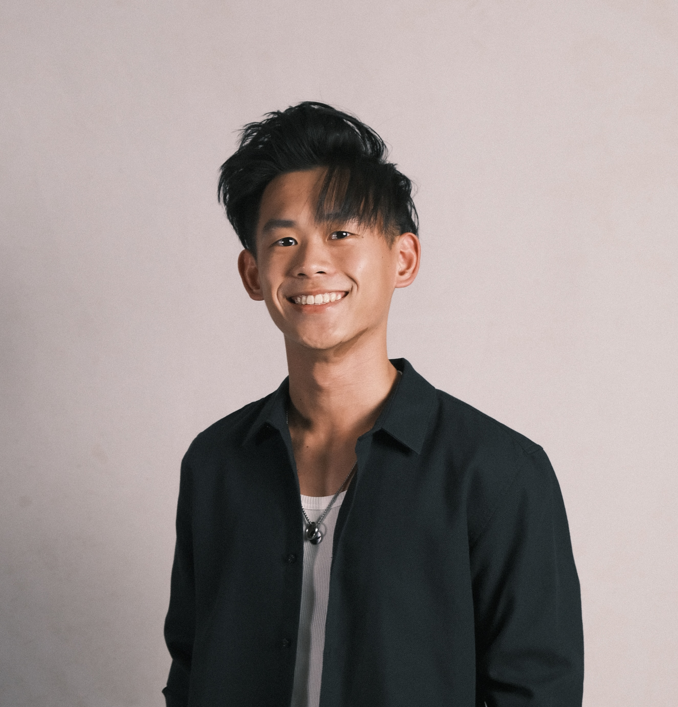

# About Us

We are a team based in the [School of Computing, National University of Singapore](http://www.comp.nus.edu.sg).

You can reach us at the email `seer[at]comp.nus.edu.sg`

## Project team

### Devanshu Bisht

[[homepage](http://www.comp.nus.edu.sg/~damithch)]
[[github](https://github.com/devanshubisht)]
[[portfolio](team/devanshubisht.md)]

* Role: Project Advisor

### Phinehas Tan

[[github](http://github.com/phiphi-tan)]
[[portfolio](team/phiphi-tan.md)]

* Role: Deliverables and Deadlines
* Responsibilities: Ensure project deliverables are done on time and in the right format

### Sun Zihan

[[github](https://github.com/sunzihan23)]
[[portfolio](team/sunzihan23.md)]

* Role: Code quality, documentation
* Responsibilities: Ensures adherence to coding standards, responsible for the quality of project documents

### Tiong Jjyi

[[github](http://github.com/tiongjjyi)]
[[portfolio](team/tiongjjyi.md)]

* Role: Scheduling and tracking
* Responsibilities: In charge of defining, assigning, and tracking project tasks.

### Gallen Ong

[[github](http://github.com/gongg21)]
[[portfolio](team/gongg21.md)]

* Role: Developer
* Responsibilities: In charge of command logic and integration. 
