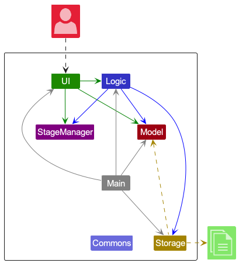
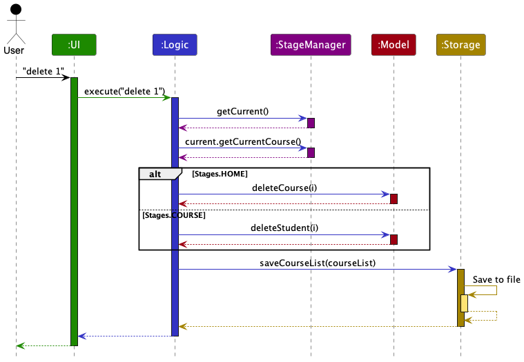
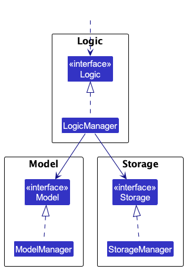
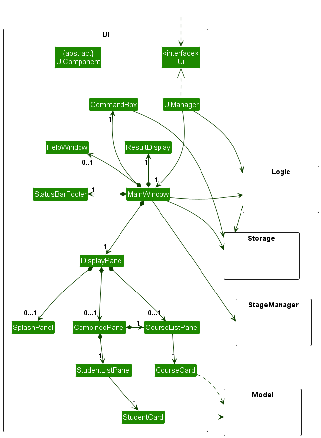
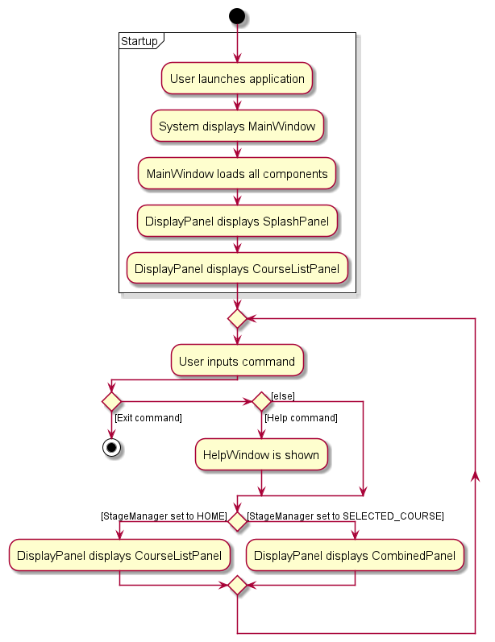
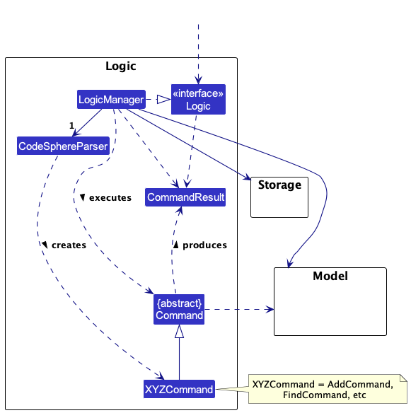
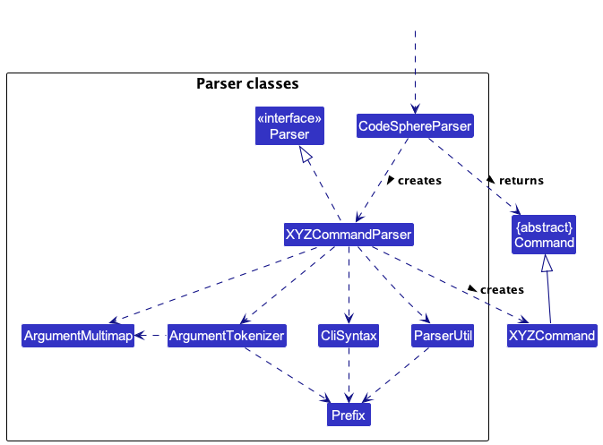
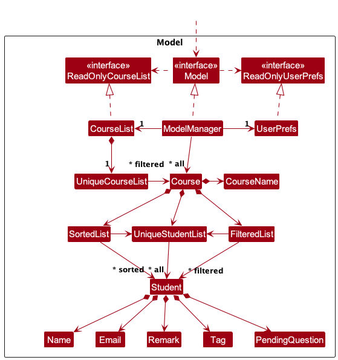
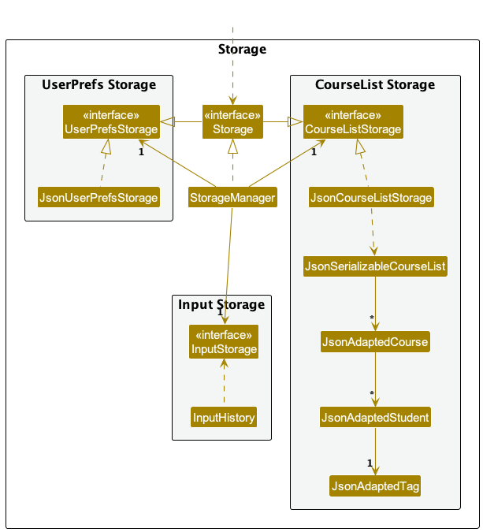
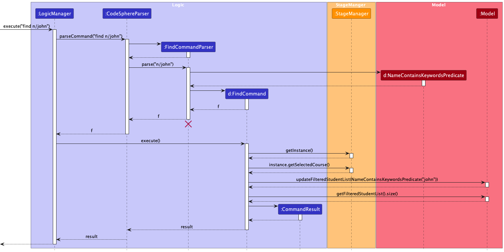

* Table of Contents
{:toc}

--------------------------------------------------------------------------------------------------------------------

## **Acknowledgements**

* {list here sources of all reused/adapted ideas, code, documentation, and third-party libraries -- include links to the original source as well}

--------------------------------------------------------------------------------------------------------------------

## **Setting up, getting started**

Refer to the guide [_Setting up and getting started_](SettingUp.md).

--------------------------------------------------------------------------------------------------------------------

## **Design**

:bulb: **Tip:** The `.puml` files used to create diagrams in this document can be found in the [`diagrams`](https://github.com/AY2324S1-CS2103T-W15-4/tp/tree/master/docs/diagrams) folder. Refer to the [_PlantUML Tutorial_ at se-edu/guides](https://se-education.org/guides/tutorials/plantUml.html) to learn how to create and edit diagrams.

### Architecture

The ***Architecture Diagram*** given above explains the high-level design of the App.
Given below is a quick overview of main components and how they interact with each other.

**Main components of the architecture**

**`Main`** has two classes called [`Main`](https://github.com/AY2324S1-CS2103T-W15-4/tp/blob/master/src/main/java/seedu/address/Main.java)
and [`MainApp`](https://github.com/AY2324S1-CS2103T-W15-4/tp/blob/master/src/main/java/seedu/address/MainApp.java)
* At app launch: Initializes the components in the correct sequence, and connects them up with each other.
* At shut down: Shuts down the components and invokes cleanup methods where necessary.

[**`Commons`**](#common-classes) represents a collection of classes used by multiple other components.

The rest of the App consists of five components.

* [**`UI`**](#ui-component): The UI of the App.
* [**`Logic`**](#logic-component): The command executor.
* [**`Model`**](#model-component): Holds the data of the App in memory.
* [**`Storage`**](#storage-component): Reads data from, and writes data to, the hard disk.
* [**`StageManager`**](#stageManager-component): Keeps track of the App's current stage.

**How the architecture components interact with each other**

The *Sequence Diagram* below shows how the components interact with each other for the scenario where the user issues the command `delete 1`.

StageManager (shown in the diagram above) is accessible by the Logic component for checking and updating the app's current stage.

Each of the other four main components (also shown in the diagram above),

* defines its *API* in an `interface` with the same name as the Component.
* implements its functionality using a concrete `{Component Name}Manager` class which follows the corresponding API `interface` mentioned in the previous point.

For example, the `Logic` component defines its API in the `Logic.java` interface and implements its functionality using the `LogicManager.java` class which follows the `Logic` interface.

Other components interact with a given component through its interface rather than the concrete class (reason: to prevent outside component's being coupled to the implementation of a component),
as illustrated in the (partial) class diagram below.

The sections below give more details of each component.

### UI component

The **API** of this component is specified in [`Ui.java`](https://github.com/AY2324S1-CS2103T-W15-4/tp/blob/master/src/main/java/seedu/address/ui/Ui.java)

The UI consists of a `MainWindow` that is made up of parts e.g.`CommandBox`, `ResultDisplay`, `CourseListPanel`, `CombinedPanel`, `StatusBarFooter` etc.
All these, including the `MainWindow`, inherit from the abstract `UiComponent` class which captures the commonalities between classes that represent parts of the visible GUI.

The `MainWindow` includes a `DisplayPanel`, which has three different states it can toggle between
1. The `SplashPanel` for the opening splash window
2. The `CombinedPanel` that displays the student list and a course list sidebar
3. The `CoursePanel` that displays the course list (this is otherwise known as the `home` screen)

The `UI` component uses the JavaFx UI framework.
The layout of these UI components are defined in matching `.fxml` files that are in the `src/main/resources/view` folder.
For example, the layout of the [`MainWindow`](https://github.com/AY2324S1-CS2103T-W15-4/tp/blob/master/src/main/java/seedu/address/ui/MainWindow.java) is specified in [`MainWindow.fxml`](https://github.com/AY2324S1-CS2103T-W15-4/tp/blob/master/src/main/resources/view/MainWindow.fxml)

The `UI` component,
* executes user commands using the `Logic` component.
* listens for changes to `Model` data so that the `UI` can be updated with the modified data.
* keeps a reference to the `Logic` component, because the `UI` relies on the `Logic` to execute the commands.
* keeps a reference to the `StageManager` to update the `UI` with its corresponding display panel.
* depends on some classes in the `Model` component, as it displays `Course` and `Student` objects residing in the `Model`.
* depends on some classes in the `Storage` component, as it updates to and retrieves user inputs from the `Storage`.

The typical flow of a user's interaction with the UI is as follows.

During startup, the MainWindow will be displayed and all components loaded into it, with a splash screen showing before
entering the course list display.

For user commands, there are two unique commands which cause separate actions to be performed:
* `exit`, which immediately closes the application.
* `help`, which displays the help window pop-up.

After each command (assuming the application is not closed), the UI will check with the StageManager to see which stage it is set to,
(either StageManager.HOME or StageManager.SELECTED_COURSE) and displays the corresponding panel
(CourseListPanel for `HOME` and CombinedPanel for `SELECTED_COURSE`).

This action flow will loop until the user decides to exit the application.
During the application's runtime, the user may  also exit the application through the MainWindow's top panel buttons (File -> Exit)
or the red '**x**' button on the top right of the application screen.

### Logic component

**API** : [`Logic.java`](https://github.com/AY2324S1-CS2103T-W15-4/tp/blob/master/src/main/java/seedu/address/logic/Logic.java)

Here's a (partial) class diagram of the `Logic` component:

The sequence diagram bellow ilustrates the interactions within the `Logic` componenet, using `execute("delete 1")` API call as an example.

How the `Logic` component works:
1. When `Logic` is called upon to execute a command, it uses the `CodeSphereParser` object to parse the user command. This in turns creates a parser that matches the command (e.g., `DeleteCourseCommandParser`) which will parse the relevant arguments in the user input.
2. This results in a `Command` object (more precisely, an object of one of its subclasses e.g., `AddCommand`) which is executed by the `LogicManager`.
3. The command can communicate with the `Model` when it is executed (e.g. to add an item).
4. The result of the command execution is encapsulated as a `CommandResult` object which is returned from `Logic`.

:information_source: **Note:** The lifeline for `DeleteCourseCommandParser` should end at the destroy marker (X) but due to a limitation of PlantUML, the lifeline reaches the end of diagram.

Here are the other classes in `Logic` (omitted from the class diagram above) that are used for parsing a user command:

How the parsing works:
* When called upon to parse a user command, the `CodeSphereParser` class creates an `XYZCommandParser` (`XYZ` is a placeholder for the specific command name e.g., `AddCommandParser`) which uses the other classes shown above to parse the user command and create a `XYZCommand` object (e.g., `AddCommand`) which the `CodeSphereParser` returns back as a `Command` object.
* All `XYZCommandParser` classes (e.g., `AddCommandParser`, `DeleteCommandParser`, ...) inherit from the `Parser` interface so that they can be treated similarly where possible e.g, during testing.
* All `XYZCommandParser` classes throw a ParseException if there are any errors with the arguments.

### Model component
**API** : [`Model.java`](https://github.com/AY2324S1-CS2103T-W15-4/tp/blob/master/src/main/java/seedu/address/model/Model.java)

The `Model` component,

* stores the app data i.e., all `Course` and `Student` objects (which are contained in a `UniqueCourseList` and `UniqueStudentList` objects respectively).
* stores the currently 'selected' `Course` objects (e.g., results of a search query) as a separate _filtered_ list which is exposed to outsiders as an unmodifiable `ObservableList<Course>` that can be 'observed' e.g. the UI can be bound to this list so that the UI automatically updates when the data in the list change.
* stores the currently 'selected course's' `Student` objects (e.g., results of a search query) as a separate _filtered_ list which is exposed to outsiders as an unmodifiable `ObservableList<Student>` that can be 'observed' e.g. the UI can be bound to this list so that the UI automatically updates when the data in the list change.
* stores a `UserPref` object that represents the user’s preferences. This is exposed to the outside as a `ReadOnlyUserPref` objects.
* does not depend on any of the other three components (as the `Model` represents data entities of the domain, they should make sense on their own without depending on other components).

### Storage component

**API** : [`Storage.java`](https://github.com/AY2324S1-CS2103T-W15-4/tp/blob/master/src/main/java/seedu/address/storage/Storage.java)

The `Storage` component,
* can save both CourseList data and user preference data in json format, and read them back into corresponding objects.
* can save user inputs and retrieve them in the future
* inherits from both `CourseListStorage` and `UserPrefStorage`, which means it can be treated as either one (if only the functionality of only one is needed).
* depends on some classes in the `Model` component (because the `Storage` component's job is to save/retrieve objects that belong to the `Model`)

The Storage component builds upon the AB-3 Storage component by adding an InputStorage, which encapsulates the concept of
storing user inputs.
These user inputs are stored in chronological order and are accessed through the StorageManager.
All user inputs will be stored in the InputStorage, and will also contain the data whether the input was accepted as a
valid command or not. Handling of this input validity will be done by the UI component. 

### Common classes

Classes used by multiple components are in the `seedu.codesphere.commons` package.

--------------------------------------------------------------------------------------------------------------------
## **Implementation**

This section describes some noteworthy details on how certain features are implemented.

### Add a student
After selecting a `Course` from the `UniqueCourseList`,  `Student` objects can be added into the `UniqueStudentList` of the `Course`.  Compulsory fields for the `AddCommand` include `Name`, `Email` and a performance `Tag`. The optional `Remark` and `PendingQuestion` fields cannot be added using the `AddCommand`.
Given below is an example usage scenario and how the adding mechanism works. We will skip to where the `AddCommand#execute()` method is called.

* Step 1. The `AddCommand` object’s `execute()` method is called.
* Step 2. `StageManager` is used to obtain the current `Course` selected.
* Step 3. A check for duplicates in the `UniqueStudentList` of the current `Course` is done. If the new `Student` to be added already exists, a `CommandException` is thrown.
* Step 4. The new `Student` is added into the `UniqueStudentList` of the current `Course`.

### Edit a student
`Student` objects are stored in their respective Course’s `UniqueStudentList`. The details (name, email, remark, pending question, tag) of a student in a course can be edited by changing the fields of the `Student` object.
Given below is an example usage scenario and how the editing mechanism is carried out on a `Student` in a course. We will skip to where the `EditCommand#execute()` method is called.

* Step 1. The `EditCommand` object’s `execute()` method is called.
* Step 2. The index provided is checked to be within bounds of the course’s student list. If it is not, a `CommandException` is thrown.
* Step 3. A new `Student` object, `editedStudent` is created with the edited inputs.
* Step 4. A check for duplicates in the current course is done. If there is a duplicate, a `CommandException` is thrown.
* Step 5. The original student in the current course’s student list is replaced with `editedStudent`.

### Edit a course
A course’s course name can be edited by changing the `CourseName` field of a `Course` object.
Given below is an example usage scenario and how the editing mechanism is carried out. As per the examples above, we will skip to where the `EditCourseCommand#execute()` method is called.

* Step 1. The `EditCourseCommand` object’s `execute()` method is called.
* Step 2. The index provided is checked to be within bounds of the course’s student list. If it is not, a `CommandException` is thrown.
* Step 3. A new `Course` object, `editedCourse` is created with the edited course name.
* Step 4. A check for duplicates in the model is done. If there is a duplicate, a `CommandException` is thrown.
* Step 5. The original course is replaced with `editedCourse`.

### Add a Pending Question to a Student from a selected Course

#### About the adding a pending question feature

The `pq` command allows the user to add a pending question to a student based on the index input from the user.
For example, a user could add a pending question such as `Tutorial 1 Question 10` to the second student from the list by using `pq 2 pq/Tutorial 1 Question 10`.
It's important to note that adding a pending question to a student is not cumulative. In other words, adding another pending question to a student with an existing pending question will replace the old pending question with the new one.

#### Implementation Details
The partial class diagram of the `pq` command can be seen.

#### Parsing user input
1. The user inputs the `pq` command, provides the index of the targeted student, and follows it by the pending question using the prefix `pq`.
2. The `CodeSphereParser` then does preliminary processing to the user input and creates a new `PendingQuestionCommandParser`.
3. The `PendingQuestionCommandParser` parses the user input and checks whether the input is the correct format. For example, the index must be valid and the input after `pq` cannot be empty.
 
If the conditions are not met, a `ParseException` is thrown.

#### Command execution
1. The `LogicManager` executes the `PendingQuestionCommand`.
2. `StageManager` is used to retrieve the current `Course` by calling `StageManager#getCurrentCourse()`.
3. The `PendingQuestionCommand` calls the `Course#getFilteredStudentList()` to obtain a list of `Student` belonging to the course object and identify the targeted `Student` from the list.
4. A check for index from the user input will be done.If the index is invalid, a `CommandException` will be thrown.
5. A new `Student` object is created by passing in the `PendingQuestion` instance to the Student constructor.
6. Update the newly created Student instance to replace the old Student instance.

#### Displaying of result
1. The `PendingQuestionCommand` will create a `CommandResult` with a success message and return it to the LogicManager to complete the command execution. The GUI will also be updated accordingly as it calls the `filteredStudentList` which was updated during the execution of the command.

The following sequence diagram shows how the `pq` mechanism works:

### Finding a student from a selected course

#### About the find feature

The `find` command allows users to search for relevant students based on details of the specified criteria in their input. For example, a user could use `find n/KEYWORDS` to find a students names which contain or match that with the keywords.
They can use keywords in `NAME`, `EMAIL`, `TAG`, `REMARK` to find students with words or phrases containing all of the words mentioned in keywords.
Do note that only 1 criteria can be used at one time.

#### Implementation Details

The partial class diagram of the `find` command can be seen. What is important to note here is the use of a `Predicate` class and the `updateFilteredStudentList` method which utilises the predicate class.

Their are multiple different predicate classes created to accurately filter through the student list. Below, is the example usage scenario and how the `find` mechanism behaves at each step.

#### Parsing user input

1. The user inputs the `find` command and provide the input with the attribute of the student contact and its respective prefix (eg. `n/NAME` or `r/REMARK`) in which the user wants to find the student.

2. The `CodeSphereParser` then does preliminary processing to the user input and creates a new `FindCommandParser`.

3. The `FindCommandParser` parses the user inputs and checks for whether the input is the correct format. The input needs to contain only 1 prefix and the keywords cannot be empty.

If the conditions are not met a `ParseException` is thrown.

4. If the format is valid, a predicate class matching the prefix is created. For example, for `NAME`, the predicate object created is `NameContainsKeywordsPredicate`. This class takes in the values of the keywords and the object is passed into the newly created `FindCommand` object.

#### Command execution

1. The `LogicManager` executes the `FindCommand`.

2. The `FindCommand` calls the `Model#updateFilteredPersonList()` to update the filtered person list based on predicate class.

3. The `FindCommand` then calls the `Model#getFilteredPersonList()#size()` to get the size of the person list. The size will correspond to the number of persons listed.

#### Displaying of result

1. The `FindCommand` will create a `CommandResult` with a success message and return it to the `LogicManager` to complete the command execution. The GUI will also be updated accordingly as it calls the `filteredStudentList` which was updated during the execution of the command.

The following sequence diagram shows how the `find` mechanism works:

#### Design Considerations

**Aspect:** How should multiple keywords be considered

- *Currently:* Whether all keywords are contained in any order in the specified criteria
- *Alternative 1:* At least 1 keyword is contained

**Pros and Cons:**
- *Currently:*
  - **Pros:** Provides a more specific and refined search.
  - **Cons:** May result in fewer matches if all keywords are not present.

- *Alternative 1:*
  - **Pros:** Increases the likelihood of finding matches.
  - **Cons:** Might lead to less precise results if only one keyword is present.

**Aspect:** How should the filtered list be filtered based on the keywords

- *Currently:* As long as keywords are contained inside
- *Alternative 1:* Instead of contains, do a complete word match

**Pros and Cons:**
- *Currently:*
  - **Pros:** More flexible and tolerant to variations in keyword placement.
  - **Cons:** May include irrelevant matches if keywords are part of larger words.

- *Alternative 1:*
  - **Pros:** Provides more precise matching by requiring complete word matches.
  - **Cons:** May exclude relevant matches if keywords are not complete words.

These considerations and alternatives should be weighed based on the specific requirements and expected user experience in your application.
You can copy and paste this code into a Markdown editor or file to render the formatted text.

--------------------------------------------------------------------------------------------------------------------
## **Documentation, logging, testing, configurations, dev-ops**
* [Documentation guide](Documentation.md)
* [Logging guide](Logging.md)
* [Testing guide](Testing.md)
* [Configurations guide](Configuration.md)
* [DevOps guide](DevOps.md)

--------------------------------------------------------------------------------------------------------------------
## **Appendix: Requirements**

### Product scope

**Target user profile**:

* wants to be able to manage student information
* wants to be able to keep track of student performance
* prefer desktop apps over other types
* prefers typing to mouse interactions
* is reasonably comfortable using CLI apps

**Value proposition**: provides an easy way to manage students, allowing for customised support to keep tabs on each student.

### User stories

Priorities: High (must have) - `* * *`, Medium (nice to have) - `* *`, Low (unlikely to have) - `*`

| Priority | As a …​                 | I want to …​                                                           | So that I can…​                                                         |
|-------|-------------------------|------------------------------------------------------------------------|-------------------------------------------------------------------------|
| `* * *` | user                    | add a new course                                                       | keep track of the courses I teach                                       |
| `* * *` | user                    | add a new student to an existing course                                | keep track of the students in each of the courses I teach               |
| `* * *` | user                    | edit a course                                                          | keep accurate and up-to-date information on each course                 |
| `* * *` | user                    | edit a student's profile                                               | keep accurate and up-to-date information on each student                |
| `* * *` | user                    | delete s course                                                        | remove a course I am no longer teaching                                 |
| `* * *` | user                    | delete a student's profile                                             | remove a student if the student is no longer in a course                |
| `* * *` | user                    | assign a performance tag to a student based on how well they are coping | I can easily identify students who may need additional support          |
| `* *` | user                    | add remarks for a student                                              | keep track of miscallaneous things                                      |
| `* *` | user                    | add pending questions for a students                                   | keep track of unanswered queries from students                          |
| `* *` | user                    | search for courses based on the course name                            | easily find courses I need                                              |
| `* *` | user                    | search for students using the specified field                          | easily find students who belong in the criteria that I am interested in |
| `* *` | user                    | sort students by the specified field                                   | view the list of students in the order I require                        |
| `* * ` | user                    | view usage instructions                                                | know how to use the app when I am unfamiliar with it                    |
| `*`   | user                    | list out all students in a course with unanswered pending questions    | efficiently manage and respond to queries                               |
| `*`   | user                    | reset the student list to its original order            | view the original student list after filtering or sorting               |

### Use cases

(For all use cases below, the **System** is the `CodeSphere` and the **Actor** is the `user`, unless specified otherwise)

**Use case: UC01 - Add a course**

**MSS**

1. User requests to add a new course.
2. CodeSphere creates the course and provides confirmation to the user. 

   Use case ends.

**Extensions**

* 1a. The course name is missing.
    * 1a1. CodeSphere displays an error message. 
      Use case resumes at step 1.

* 1b. The course name has an invalid format.
  * 1b1. CodeSphere displays an error message. 
    Use case resumes at step 1.

**Use case: UC02 - Edit a student’s information**

**Preconditions**: The student has already been added into CodeSphere.

**Guarantees**: Unchanged fields during the edit will remain the same as before the edit.

**MSS**

1. User requests to edit a student’s information.
2. User enters new details for the field(s) that need to be changed.
3. CodeSphere updates the student’s information and provides confirmation to the user. 
    Use case ends.

**Extensions**

* 1a. The given index of the student is invalid.
    * 1a1. CodeSphere displays an error message. 
    Use case resumes at step 1.

* 1b. No field to be edited was specified by the user.
    * 1b1. CodeSphere displays an error message. 
      Use case resumes at step 1.

* 1c. Invalid format for detail(s) entered.
    * 1c1. CodeSphere displays an error message. 
      Use case resumes at step 1.

**Use case: UC03 - Delete a student**

**Preconditions**: The student has already been added into CodeSphere.

**MSS**

1. User requests to delete a student.
2. CodeSphere deletes the specified student and no longer display that student in the student list. 
   Use Case Ends.

**Extensions**

* 1a. The given index of the student is invalid.
    * 1a1. CodeSphere displays an error message. 
    Use case resumes at step 1.

**Use case: UC04 - Add a pending question for a student**

**Preconditions**: The student has already been added into CodeSphere.

**MSS**

1. User requests to add a pending question to a student.
2. CodeSphere adds a pending question to the student. 
   Use Case Ends.

**Extensions**

* 1a. The given index of the student is invalid.
    * 1a1. CodeSphere displays an error message. 
      Use case resumes at step 1.

* 1b. Pending question field is left empty.
    * 1b1. CodeSphere displays an error message. 
      Use case resumes at step 1.

**Use case: UC05 - Sort the student list**

**MSS**

1. User requests to sort the student list by tag or by name.
2. CodeSphere sorts the students and displays all students in the order specified by the user. 
   Use Case Ends.

**Extensions**

* 1a. User enters an invalid sort criteria.
    * 1a1. CodeSphere displays an error message. 
      Use case resumes at step 1.

* 1b. No sort criteria was specified.
    * 1b1. CodeSphere displays an error message. 
      Use case resumes at step 1.

### Non-Functional Requirements

1.  Should work on any _mainstream OS_ as long as it has Java `11` or above installed.
2.  The application should be able to hold up to 100 courses and 1000 student contacts without a noticeable sluggishness in performance for typical usage.
3.  The application should be intuitive enough for a beginner who is new to Command Line Interfaces to be able to use easily.
4.  The application should respond to any commands carried out by the user should become visible within 5 seconds.
5.  The application should gracefully handle errors, providing informative error messages to users in case of failures.
6.  Code should be organized into reusable and maintainable modules, making it easier to enhance and extend the application in the future.
7.  Comprehension documentation should be maintained for developers.
8.  The application should run smoothly on different operating systems commonly used by the target users.
9.  A user who can type fast should be able to accomplish tasks faster via a Command Line Interface as compared to a hypothetical Graphical User Interface version of the app.
10. The application should not depend on a remote server so that users can use the application at anytime.
11. The application is not required to support multiple users on a single device.

*{More to be added}*

### Glossary

* **Mainstream OS**: Windows, Linux, Unix, OS-X
* **CLI**: Command Line Interface. A way to interact with a computer or software by typing text-based commands, rather than using a mouse and graphical icons.

--------------------------------------------------------------------------------------------------------------------
## **Appendix: Instructions for manual testing**

This is a list of prefixes used for manual testing.

| Prefix | Representation     |
|--------|--------------------|
| `c/`   | `COURSE_NAME`      |
| `n/`   | `NAME`             |
| `e/`   | `EMAIL`            |
| `t/`   | `TAG`              |
| `r/`   | `REMARK`           |
| `pq/`  | `PENDING_QUESTION` |
| `s/`   | `SORT`             |

Given below are instructions to test the app manually.

:information_source: **Note:** These instructions only provide a starting point for testers to work on;
testers are expected to do more *exploratory* testing.

### Launch and shutdown

1. Initial launch.

   1. Download the jar file and copy it into an empty folder.

   2. Open a command terminal, then `cd` into the folder containing the jar file. 

   3. Use the `java -jar CodeSphere.jar` command to run the CodeSphere application.

   Expected: Shows the GUI with a set of sample courses. The window size may not be optimum. 

2. Saving window preferences.

    1. Resize the window to an optimum size, then move the window to a different location and close the window.

    2. Re-launch the app by running the `java -jar CodeSphere.jar` command again. 
       Expected: The most recent window size and location is retained.

### Clearing all data
Command: `clear`

More information on usages: [clear courses command](UserGuide.html#clearing-all-courses-clear) and [clear students command](UserGuide.html#clearing-all-students-clear)

1. Clearing all courses while all courses are being shown.

   1. Prerequisites: Ensure the current page is the home page using the `home` command. List all courses using the `reset` command.
   
   2. Test case: `clear` 
      Expected: All courses are cleared from the course list.

2. Clearing all students while all students in the selected course are being shown.

   1. Prerequisites: Ensure the current page is the course page using the `select` command. Filter the student list by a specified field using the `find` command or sort the student list by a specified sort criteria using the `sort` command.

   2. Test case: `clear` 
      Expected: All students are cleared from the student list for the selected course.

### Adding a course
Command: `add`

More information on usage: [add course command](UserGuide.html#adding-a-course--add)

1. Adding a course while all courses are being shown.

   1. Prerequisites: Ensure the current page is the home page using the `home` command. List all courses using the `reset` command.

   2. Test case: `add c/cs2101` 
      Expected: A course with course name `CS2101` is added to list of courses. 
      The course is added to the last index of the course list. The course card appeared at the last in the list. 
      The details of the added course is shown in the status message.

   3. Incorrect add course commands to try: `add`, `add c/cs`, `add cs2106 n/John Doe`, etc. 
      Expected: No course added to the course list. Error details shown in the error message.

2. Adding a course while the course list is being filtered.

   1. Prerequisites: Ensure the current page is the home page using the `home` command. Filter the courses by course name using the `find` command.

   2. Test case: Similar to previous. 
      Expected: Similar to previous.

### Deleting a course
Command: `delete`

More information on usage: [delete course command](UserGuide.html#deleting-a-course--delete)

1. Deleting a course while all courses are being shown.

    1. Prerequisites: Ensure the current page is the home page using the `home` command. List all courses using the `reset` command.

    2. Test case: `delete 1` 
       Expected: The first course is deleted from the list of courses. 
       Details of the deleted course is shown in status message. 
       All student information in the deleted course are also deleted.

    3. Test case: `delete 0` 
       Expected: No course is deleted. Error details shown in the error message.

    4. Other incorrect delete course commands to try: `delete`, `delete x` (where x is larger than the course list size), etc. 
       Expected: Similar to previous.

2. Deleting a course while the course list is being filtered.

    1. Prerequisites: Ensure the current page is the home page using the `home` command. Filter the courses by course name using the `find` command.

    2. Test case: Similar to previous. 
       Expected: Similar to previous.

### Finding courses by course name
Command: `find`

More information on usage: [find course command](UserGuide.html#finding-a-course--find)

1. Finding a course while all courses are being shown.

    1. Prerequisites: Ensure the current page is the home page using the `home` command. List all courses using the `reset` command.

    2. Test case: `find cs` or `find CS` 
       Expected: All courses with course name containing `CS` are shown.

    3. Test case: `find 20` 
       Expected: All courses with course name containing `20` are shown.

    4. Test case: `find cs 20` 
       Expected: All courses with course name containing `CS` and/or `20` are shown.

    5. Incorrect find commands to try: `find`, `find c/`, etc. 
       Expected: No student contacts filtered. Error details shown in the error message.

2. Finding a student contact while the student contact list is being filtered.

    1. Prerequisites: Ensure the current page is the home page using the `home` command. Filter the courses by course name using the `find` command.

    2. Test case: `find 20`  
       Expected: If the course list was initially filtered with `find s` before `find 20`, all courses with course name containing `s` and `20` are shown.

    3. Incorrect find commands to try: `find`, `find c/`, etc. 
       Expected: No student contacts filtered. 
       Error details shown in the error message.

### Selecting a course
Command: `select`

More information on usage: [select course command](UserGuide.html#selecting-a-course--select)

1. Selecting a course while all courses are being shown.
    1. Prerequisites: Ensure the current page is the home page using the `home` command. List all courses using the `reset` command.

    2. Test case: `select 1` 
       Expected: The first course is selected from the list of courses. 
       The display changed to show 2 columns. The course list is displayed in the left column, while all students in the selected course are displayed in the right column. 
       Details of the selected course is shown in status message. 

    3. Test case: `delete 0` 
       Expected: No course is selected. Error details shown in the error message.

    4. Other incorrect select course commands to try: `select`, `delete x` (where x is larger than the course list size), etc. 
       Expected: Similar to previous.

2. Selecting a course while the course list is being filtered.
    1. Prerequisites: Ensure the current page is the home page using the `home` command. Filter the courses by course name using the `find` command.

    2. Test case: Similar to previous. 
       Expected: Similar to previous.

### Adding a student
Command: `add`

More information on usage: [add student command](UserGuide.html#adding-a-student--add)

1. Adding a student while all students in the selected course are being shown.
    1. Prerequisites: Ensure the current page is the course page using the `select` command. List all student using the `reset` command.

    2. Test case: `add n/John Doe e/e1234567@u.nus.edu t/good` 
       Expected: A student with name `John Doe` with the entered attributes is added to student list. 
       The student is added to the last index of the student list. The student card appeared at the last in the student list. 
       The details of the added student is shown in the status message.

    3. Test case: `add n/John Doe e/e1111111@u.nus.edu t/good`  
       Expected: A student with name `John Doe` with the entered attributes is added to student list. 
       Note that the `NAME` of this student is the same as that of test case 2. However, the student contact's `EMAIL` are **different**. 
       The student is added to the last index of the student list. The student card appeared at the last in the student list. 
       The details of the added student is shown in the status message.

    4. Incorrect add course commands to try: `add`, `add c/cs`, `add n/John Doe`, `add n/John Doe e/john@gmail.com t/good`, `add n/John Doe e/e2222222@u.nus.edu t/friend`, etc. 
       Expected: No course added to the course list. Error details shown in the error message.

2. Adding a student with duplicate/identical `EMAIL` attributes.
    1. Prerequisites: There exists a student in student list with `EMAIL` attribute `e1234567@u.nus.edu`. 
       Example: `n/John Doe e/e1234567@u.nus.edu t/good`

    2. Test case: `add n/John Doe e/e1234567@u.nus.edu t/good` 
       Expected: No student is added to the student list because the student has the same `EMAIL` as an existing student in the list. 
       Error details shown in the error message.

3. Adding a student while the student list is being filtered or sorted.

    1. Prerequisites: Ensure the current page is the course page using the `select` command. Filter the student list by a specified field using the `find` command or sort the student list by a specified sort criteria using the `sort` command.

    2. Test case: Similar to previous. 
       Expected: Similar to previous. 
       But note that the student list is reset to show all students after adding a student successfully.

### Adding a remark to a student
Command: `remark`

More information on usage: [remark student command](UserGuide.html#adding-a-remark-for-a-student--remark)

1. Adding a remark to a student while all students in the selected course are being shown.

   1. Prerequisites: Ensure the current page is the course page using the `select` command. List all student using the `reset` command.

   2. Test case: `remark 1 r/Needs more help` 
      Expected: The remark `Needs more help` is added to the first student in the student list. 
      The details of the first student is shown in the status message.

   3. Test case: `remark 0 r/Needs more help` 
      Expected: No remark is added. 
      Error details shown in the status message.

   4. Test case: `remark 1 r/` 
      Expected: No remark is added. 
      Error details shown in the status message.

   5. Other incorrect remark commands to try: `remark`, `remark x` (where x is larger than the list size), etc. 
      Expected: Similar to previous.

2. Adding a remark to a student while the student list is being filtered or sorted.

   1. Prerequisites: Ensure the current page is the course page using the `select` command. Filter the student list by a specified field using the `find` command or sort the student list by a specified sort criteria using the `sort` command.

   2. Test case: Similar to previous. 
      Expected: Similar to previous.

### Sorting the student list
Command: `sort`

More information on usage: [sort students command](UserGuide.html#sorting-all-students--sort)

1. Sorting the student list by the specified sort criteria while all students in the selected course are being shown.

    1. Prerequisites: Ensure the current page is the course page using the `select` command. List all student using the `reset` command.

    2. Test case: `sort s/tag` 
       Expected: The student list is arranged according to performance tags, with students tagged as `GOOD` at the top of the list. 
       `NAME` is used as a tiebreaker for students with the same `TAG`. `EMAIL` is used as the next tiebreaker for students with the same `TAG` and the same `NAME`. 
       Success message shown as the status message.

    3. Test case: `sort s/name` 
       Expected: The student list is arranged in alphabetical order according to names. Students with names starting with 'A' are shown at the top of the list. 
       `EMAIL` is used as the tiebreaker for students with the same `NAME`. 
       Success message shown as the status message.

    4. Test case: `sort s/gender` 
       Expected: Student list is not sorted. 
       Error details shown in the status message.

    5. Other incorrect remark commands to try: `sort`, `sort s/`, etc. 
       Expected: Similar to previous.

2. Sorting the student list by the specified sort criteria while the student list is already being sorted.

    1. Prerequisites: Ensure the current page is the course page using the `select` command. Sort the student list by a specified sort criteria using the `sort` command.

    2. Test case: Similar to previous. 
       Expected: Similar to previous. 
       Note that the student list will only be sorted by one sort criteria. The new sort criteria overrides the previous sort criteria. 

3. Sorting the student list by the specified sort criteria while the student list is already being filtered.

   1. Prerequisites: Ensure the current page is the course page using the `select` command. Filter the student list by a specified field using the `find` command.

   2. Test case: Similar to previous. 
      Expected: Similar to previous. 
      Note that sorting and filtering can be stacked. Sorting is done on top of the currently filtered list.
