CodeSphere is a **desktop contact management app, optimised for use via a Command Line Interface [(CLI)](#glossary)** while still having the benefits of a Graphical User Interface [(GUI)](#glossary).
It is an app targeted at Teaching Assistants (TAs) in the National University of Singapore (NUS) School of Computing (SoC) to help them better manage administration of their students.

We understand that as a TA, you might often find it difficult to keep track of all your students' progress and administrative matters.
And that is why we have developed CodeSphere for you. With CodeSphere, you will have a simple and effect way to manage your students, allowing for customised support to keep tabs on each student.

It doesn't matter if you are a new or experienced TA, with CodeSphere, you can easily:
* Add a course that you teach.
* Then, add students into that course.

And to find out more about what else CodeSphere can do for you, continue to read the rest of this all-encompassing user guide.

## Table of Contents
1. [**User Guide Tips**](#user-guide-tips)
2. [**Quick Start**](#quick-start)
3. [**Tutorial for Beginners**](#tutorial-for-beginners)
4. [**Features**](#features)
    * [**Accessing Input History**](#accessing-input-history)
    * [**Universal Commands**](#universal-commands)
        * [`help` Viewing help](#viewing-help--help)
        * [`exit` Exiting the program](#exiting-the-program--exit)
    * [**Home Page Commands**](#home-page-commands)
        * [`add` Adding a new course](#adding-a-course--add)
        * [`edit` Editing the details of a course](#editing-a-course--edit)
        * [`delete` Deleting a course](#deleting-a-course--delete)
        * [`clear` Clearing all courses](#clearing-all-courses--clear)
        * [`select` Selecting a course](#selecting-a-course--select)
        * [`find` Finding a course](#finding-a-course--find)
        * [`reset` Resetting the course list](#resetting-the-course-list--reset)
    * [**Course Page Commands**](#course-page-commands)
        * [`add` Adding a student](#adding-a-student--add)
        * [`edit` Editing the details of a student](#editing-a-student--edit)
        * [`delete` Deleting a student](#deleting-a-student--delete)
        * [`clear` Clearing all students](#clearing-all-students--clear)
        * [`reset` Resetting the student list](#resetting-the-student-list--reset)
        * [`sort` Sorting all students](#sorting-all-students--sort)
        * [`find` Finding a student](#finding-a-student--find)
        * [`list` Finding students with pending questions](#list-all-pending-questions--list)
        * [`remark` Adding a remark for a student](#adding-a-remark-for-a-student--remark)
        * [`pq` Adding a pending question for a student](#adding-a-pending-question-for-a-student--pq)
        * [`remove` Removing a remark/pending question](#removing-a-remarkpending-question-of-a-student--remove)
        * [`home` Returning to home page](#returning-to-the-home-page--home)
    * [**Miscellaneous**](#miscellaneous)
        * [Saving the data](#saving-the-data)
        * [Editing the data file](#editing-the-data-file)
5. [**FAQ**](#faq)
6. [**Known Issues**](#known-issues)
7. [**Command summary**](#command-summary)
    * [**Home Page**](#home-page)
    * [**Course Page**](#course-page)
8. [**Glossary**](#glossary)

## **User Guide Tips**

### Finding what you need

1. [Quick Start](#quick-start) helps you set up CodeSphere.
2. [Tutorial for Beginners](#tutorial-for-beginners) walks you through our graphical interface and also guides you on managing a course in CodeSphere.
3. [Features](#features) helps you understand how all the features work.
4. [FAQ](#faq) answers the most common questions from our users. If you have questions for us, this section might prove extremely useful.
5. [Command Summary](#command-summary) provides a summarised list of our features for your easy reference.
6. [Glossary](#glossary) explains some of the more complicated terms we used in the guide.
7. [_Back to Top_](#table-of-contents) provides you with a quick shortcut to return to the table of contents.

### Understanding symbols and syntax

| Symbol/Syntax        | Meaning                                                |
|----------------------|--------------------------------------------------------|
| `command`            | A command or keyword present,                          |
| :exclamation:        | Warning or some important information for you to know. |
| :bulb:               | Tips from us!                                          |
| :information_source: | Information that you should take note of.              |

[_Back to Top_](#table-of-contents)

## **Quick Start**

1. Ensure you have Java `11` or above installed in your computer. If you do not have Java `11`, follow [this](https://docs.oracle.com/en/java/javase/11/install/overview-jdk-installation.html#GUID-8677A77F-231A-40F7-98B9-1FD0B48C346A) installation guide.
2. Download the latest `codesphere.jar` from [here](https://github.com/AY2324S1-CS2103T-W15-4/tp/releases).
3. Copy the file to the folder you want to use as the _home folder_ for your CodeSphere application.
4. Open your command terminal, then `cd` into the _home folder_.
5. Use the `java -jar CodeSphere.jar` command to run the CodeSphere application.
6. The CodeSphere home page, similar to the [GUI](#glossary) displayed below, should appear in a few seconds. Note how the app contains some sample data.

   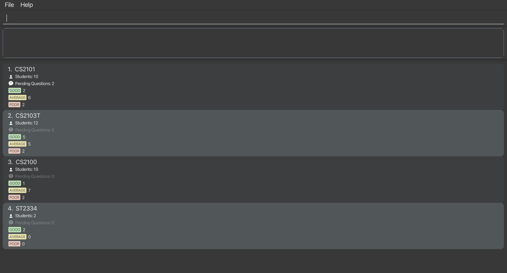

7. In the command box, type in a command and press <kbd>Enter</kbd> to execute the command. For example, typing `help` then pressing <kbd>Enter</kbd> will show the help window. Below are some other example commands you can try:
* `select 1` :  Selects the first course from the list of courses currently displayed on the home page. The [GUI](#glossary) changes to show the list of students in the selected course.
* `add c/CS1101S` : Adds a course named `CS1101S` to the course list.
* `edit 1 c/CS1231S` : Updates the course name of the first course displayed with the new course name specified.
* `delete 3` :
  1. If you are currently on the home page, it deletes the third course shown in the current list.
  2. If you are currently on the course page, it deletes the third student shown in the current list.
* `exit` : Exits the application.

For a more detailed walk-through on how to use CodeSphere to start managing your students as a TA, head to [Tutorial for Beginners](#tutorial-for-beginners).
Else, if you prefer exploring the application on your own, head to [Features](#features) below for more details on each command.

[_Back to Top_](#table-of-contents)

## **Tutorial for Beginners**
*If you are not a beginner, or would like to explore CodeSphere on your own,
feel free to skip this tutorial or jump to whichever portion you require.*

### Tutorial Contents
1. [**Adding a course**](#tutorial-adding-a-course)
2. [**Adding students**](#tutorial-adding-students)
3. [**Adding remarks / pending questions**](#tutorial-adding-remarks--pending-questions)

**Let's explore CodeSphere's features through the eyes of a TA.**
When you open up the application for the first time, after a brief splash screen of the CodeSphere logo,
you will see CodeSphere's `home` page, with 6 pre-populated sample courses.

At the top of the application, there is an underlined portion that we will refer to as the *Command Line*.
This is where your commands are typed, and they are confirmed by pressing the <kbd>Enter</kbd> key on your keyboard.
Below the Command Line is the *Result Box* (which is the outlined box),
which will tell you the outcome of any commands that you have entered.
Lastly, underneath that is the *Display Panel*, which will be updated after each command is entered.

### Tutorial: Adding a course

*(For demonstration purposes, we'll be using `CS2101` as our chosen course.
Feel free to replace this with any other course.)*

Let's begin by adding our course into the home page with the command `add c/CS2101`.
After pressing <kbd>Enter</kbd>, you will see a message informing you that there is a *New course added: CS2101* in the *Result Box* and the course `CS2101` will appear at the bottom of the list.
You will notice that an item number is displayed beside the course name (note the **7.** beside *CS2101* in the image), as well as some other information being displayed for each course, like the total number of students and total number of pending questions.

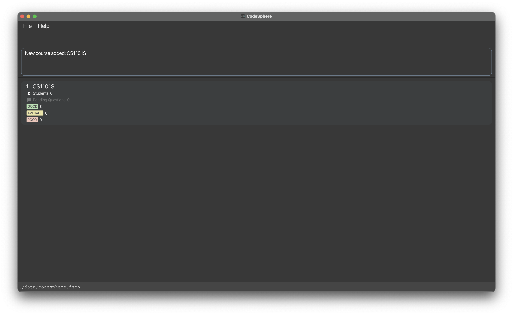

### Tutorial: Adding students

Next, let us add some students into our `CS2101` course.
To do that, we will first need to navigate into our `CS2101` course by using the command `select 7`, which selects the seventh course in the course list.

This will bring you to the course page for `CS2101` and your application should now change to look like the image below.
In the course page, the course list is now being displayed in the left column, while the right column that will be used to display students added to the selected course is currently empty because students have not been added into `CS2101`.

*Tip: You can always refer to the Result Box to see whether the command you entered has been successful.*

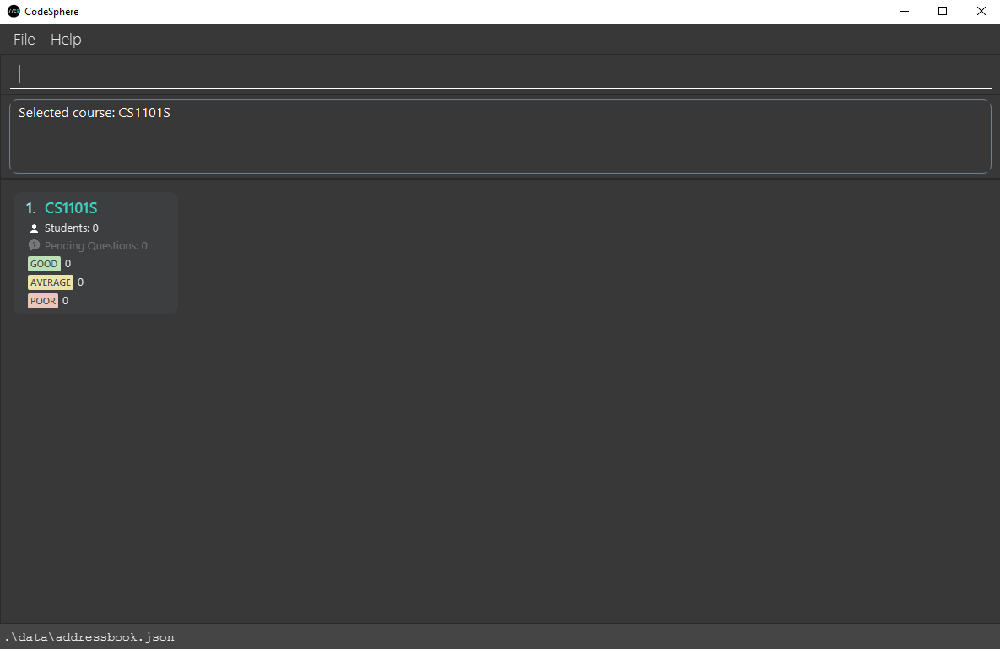

The student list for `CS2101` is currently empty, so let's add a few students into the list with the following commands:
*(Remember to press 'Enter' after each command)*
`add n/John Tan e/e0123456@u.nus.edu t/good`
`add n/Mary Lim e/e1234567@u.nus.edu t/average`
`add n/David Lee e/e2345678@u.nus.edu t/poor`

>:information_source: Note: When creating students, you must always include their name (`n/`), email (`e/`) and performance tag (`t/`).

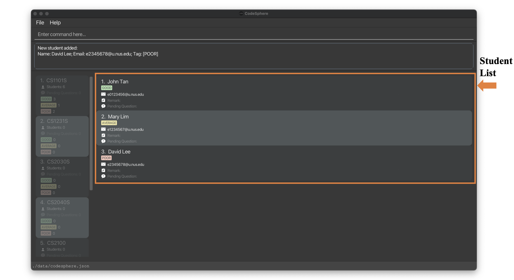

### Tutorial: Adding remarks / pending questions

Lastly, let's take a look at how we can add remarks or pending questions for a student.
To start, try adding the remark "Will be 15 minutes late for tutorial" to *John Tan* who is the first student in the list, 
by typing `remark 1 r/Will be 15 minutes late for tutorial`.

Similarly, let's note down Mary's pending question about "Tutorial 2 Question 4" through the command `pq 2 pq/Tutorial 2 Question 4`.

Your page should now be updated with the remark and pending question added to John and Mary respectively.

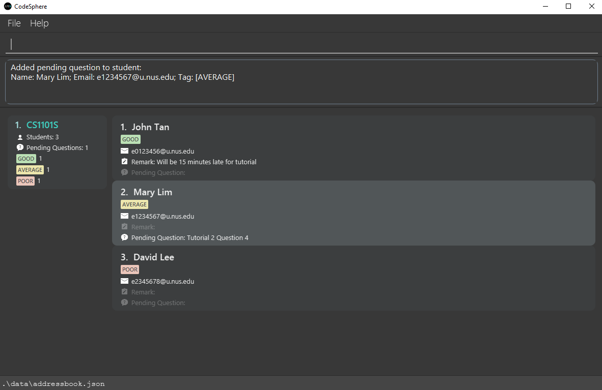

And with that, you have now successfully created your first course, added a few students, and even noted down some extra information for your students.

>:bulb: As a final tip, you can use the directional ***UP*** and ***DOWN*** keys on your keyboard to access the commands that
you have previously entered.

Now that you know how CodeSphere works, feel free to explore some other features that have been specially curated for you to manage your students with ease, such as
[listing out all students with pending questions](#list-all-pending-questions-list),
[sorting the students by different criteria](#sorting-all-students-sort) or even
[finding students with certain keywords in selected field](#finding-a-student-find).

[_Back to Top_](#table-of-contents)

## **Features**

**:information_source: Notes about the command format:** 

* Words in `UPPER_CASE` are the parameters to be supplied by the user. 
    * e.g. in `add n/NAME`, `NAME` is a parameter which can be used as `add n/John Doe`.

* Items in square brackets are optional. 
    * e.g. `n/NAME [r/REMARK]` can be used as `n/John Doe r/Need more help` or as `n/John Doe`.

### **Accessing Input History**

CodeSphere saves all inputs that you have previously entered.
In the CLI command box, just use your 'up' and 'down' arrow keys to access any inputs that you have entered before.

> :information_source: *For your information*: Inputs that were invalid will be shown in red.

[_Back to Top_](#table-of-contents)

### **Universal Commands**
Commands in CodeSphere are mostly only used exclusively on the [home page](#home-page-commands) or the [course page](#course-page-commands).
However, commands in this section can be used on either page at any time.

### Viewing help : `help`

Shows a message explaining how to access the help page.

**Format:** `help`

Entering the `help` command returns the following result:

*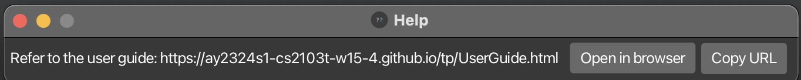*

### Exiting the program : `exit`

Exits the program.

**Format:** `exit`

[_Back to Top_](#table-of-contents)

### **Home Page Commands**
The home page in CodeSphere displays the list of courses that you are currently overseeing and have stored in the application.

**

Commands exclusive to the home page can help you:
* `add` a new course
* `edit` the details of an existing course
* `delete` an existing course
* `clear` all existing courses
* `find` all courses with course name containing the keyword specified
* `reset` the course list being displayed to its original order

There is also a `select` command that brings you to the course page of the selected course.

[_Back to Top_](#table-of-contents)

### Adding a course : `add`

Adds a course you teach to the list of courses.

**Format:** `add c/COURSE_NAME`
* `COURSE_NAME`: A valid course in NUS. Each course name should consist of a two or three letter prefix, four digits, and an optional one letter suffix.
* Note that the letters in the `COURSE_NAME` are case-insensitive, and they will all be stored and displayed as uppercase letters.

**Examples:**
* `add c/CS2103T`
* `add c/cs2100`
* `add c/GEA1000`
* `add c/st2334` returns the following result:
  *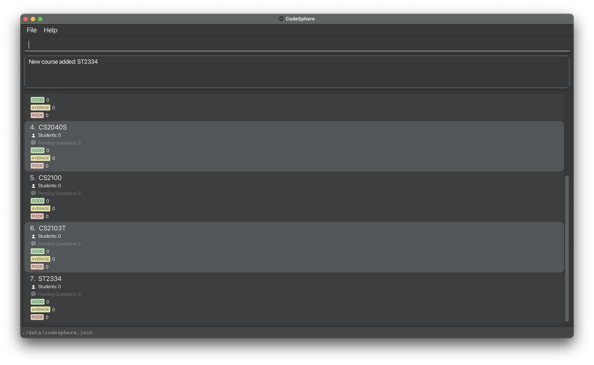*

### Editing a course : `edit`

Edits the details of an existing course from the list of courses.

**Format:** `edit INDEX c/NEW_COURSE_NAME`
* `INDEX`: Refers to the index number shown in the displayed course list. It must be a positive integer (1, 2, 3, ...), and it should fall within the range of courses currently displayed such that it corresponds to a valid course.
* `NEW_COURSE_NAME`: A valid course in NUS. Each course name should consist of a two or three letter prefix, four digits, and an optional one letter suffix.
* The existing `COURSE_NAME` for the course at the specified `INDEX` will be updated to the input `NEW_COURSE_NAME`.
* Note that the letters in the `NEW_COURSE_NAME` are case-insensitive, and they will all be stored and displayed as uppercase letters.

**Examples:**
* `edit 1 c/cs1231` edits the `COURSE_NAME` of the first course in the course list to become `CS1231`.
* `edit 1 c/CS1101` return the following result:
  *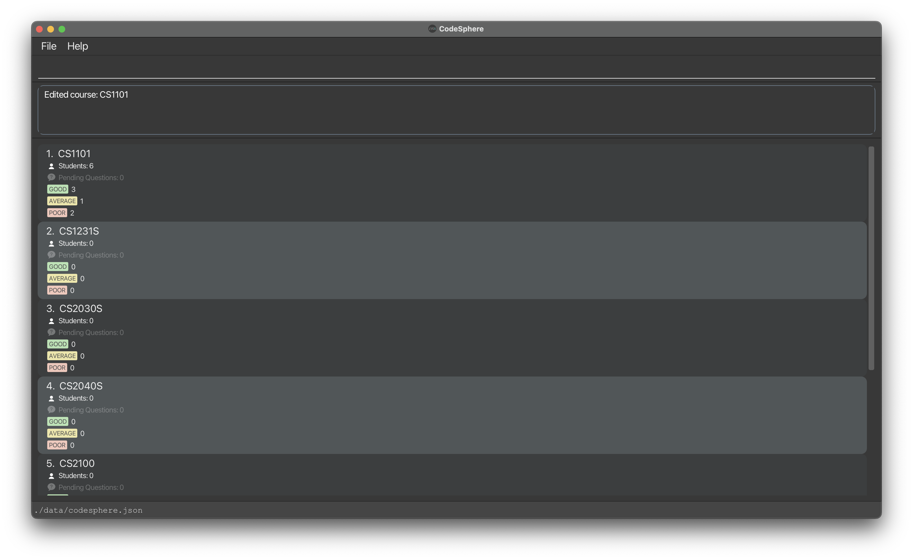*

### Deleting a course : `delete`

Deletes the specified course from the list of courses.

**Format:** `delete INDEX`
* `INDEX`: Refers to the index number shown in the displayed course list. It must be a positive integer (1, 2, 3, ...), and it should fall within the range of courses currently displayed such that it corresponds to a valid course.
* The course at the specified `INDEX` will be deleted.

**Examples:**
* `delete 4` deletes the course at index 4 in the displayed course list.
* `delete 2` returns the following result:
  *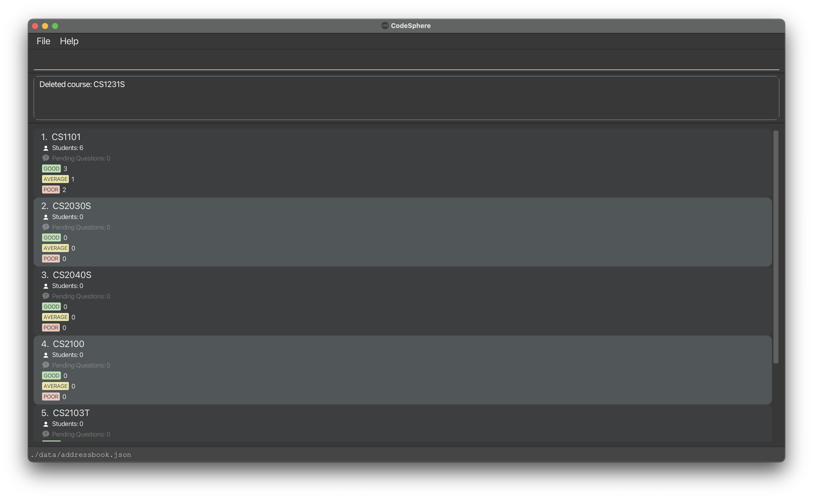*

### Clearing all courses : `clear`

Clears all courses in the displayed list of courses.

Format: `clear`
* `clear` returns the following result:
*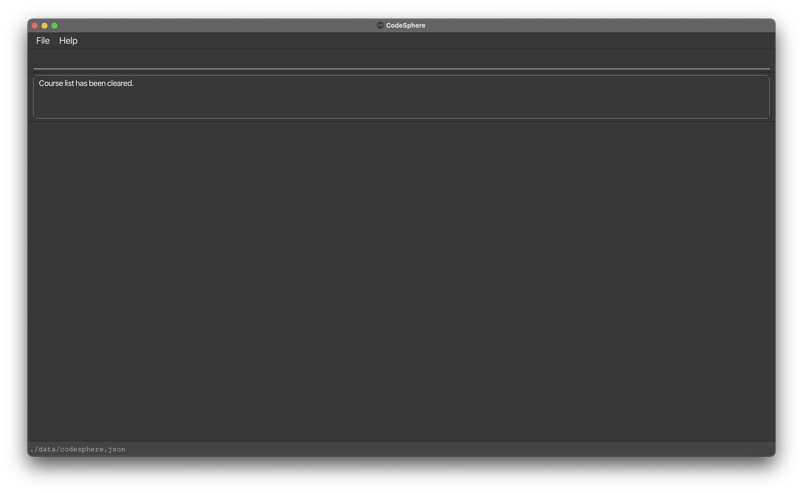*

### Selecting a course : `select`

Selects the specified course from the list of courses.

**Format:** `select INDEX`
* `INDEX`: Refers to the index number shown in the displayed course list. It must be a positive integer (1, 2, 3, ...), and it should fall within the range of courses currently displayed such that it corresponds to a valid course.
* The course at the specified `INDEX` will be selected. 

**Example:**
* `select 2` selects the course at index 2 of the displayed course list.
* `select 1` returns the following result:
*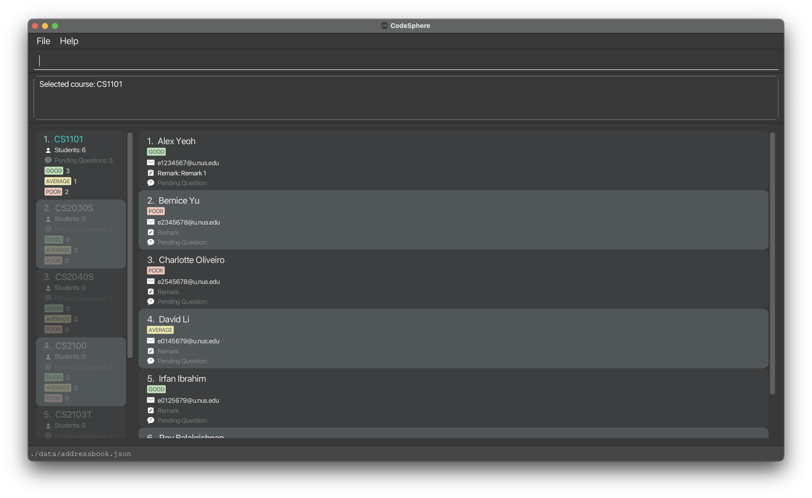*

### Finding a course : `find`
Finds courses from the list of courses that match a given a keyword.

**Format:** `find KEYWORD`
* As long as the `KEYWORD` is contained in the course name, that course will be displayed.
* The search for `KEYWORD` is case-insensitive. For example, `cs` will match any course name containing `CS`.
* If there are multiple words specified for `KEYWORD`, each word is searched for independently. The final result contains courses that contain any of the words specified for `KEYWORD`.

**Example:**
* `find S` Displays all courses with `S` in their course name.
* `find CS GEA` Displays all courses with `CS` or `GEA` in their course name.
* `find st CS1101` returns the following result:
*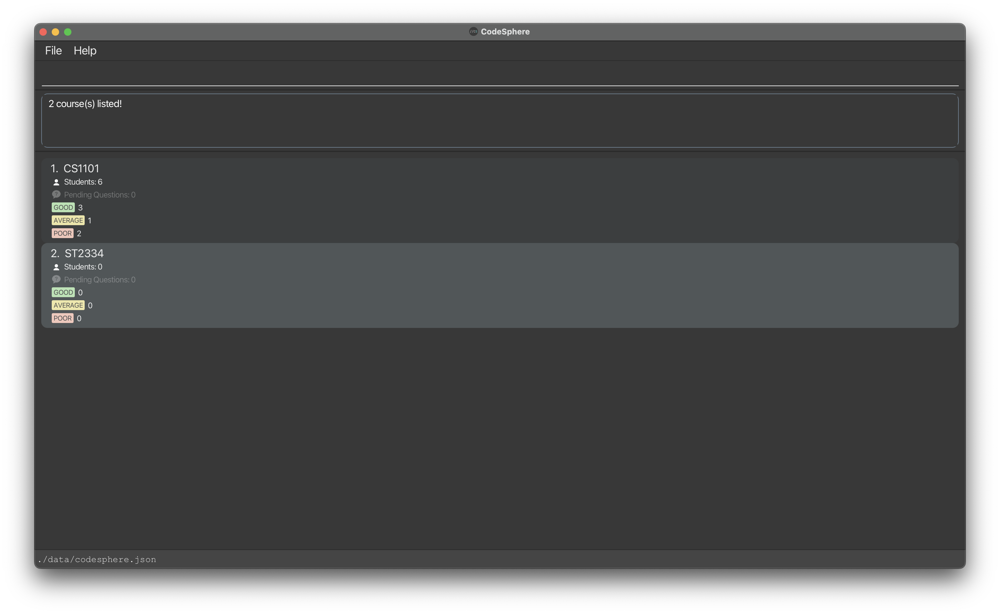*

### Resetting the course list : `reset`
Resets a filtered course list to its original order, where courses are arranged chronologically based on when they were added, with the first course added at the top of the displayed list.

**Format:** `reset`

* `reset` returns the following result:
*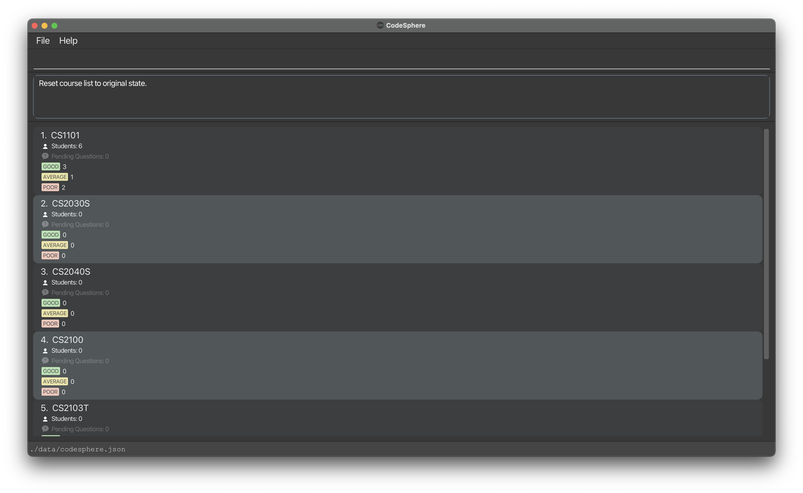*

[_Back to Top_](#table-of-contents)

### **Course Page Commands**
Once you have created and selected a course to manage, you can now start adding your students in the course that you wish to track.
The course page of a course displays the list of students that you are overseeing in your course (added by you).
Students are arranged in order of addition, with the first student added at the top of the list.

****

Commands exclusive to the course page can help you:
* `add` a new student
* `edit` the details of an existing student
* `delete` an existing student
* `clear` all existing students
* `reset` the student list displayed to its original order
* `sort` the displayed student list by the specified field
* `find` students in the course according to the specified field and keywords
* `list` all existing students with a non-empty pending question field
* add a `remark` to an existing student
* add a pending question `pq` to an existing student
* `remove` a remark or pending question from an existing student

[_Back to Top_](#table-of-contents)

### Adding a student : `add`
Adds a student to the list of students in the selected course that the user is overseeing.

**Format:** `add n/NAME e/EMAIL t/ENUM_TAG`
* `NAME`: Student names are case-sensitive and should only contain alphabets and some specified special characters (, / - ‘).
* `EMAIL`: NUS undergraduate student’s email, in the format of exxxxxxx@u.nus.edu. Alphabets in the email are case-insensitive.
* `ENUM_TAG`: A pre-defined enumerated tag. Valid tags: good, average, poor. Inputs for tags are case-insensitive.

**Examples:**
* `add n/Susan Tan e/e0946283@u.nus.edu t/GOOD`
* `add n/Koh Mei Ling, Mary e/e9739423@u.nus.edu t/AVERAGE`
* `add n/Ashley-Jane Lim e/E9739153@U.NUS.EDU t/poor` returns the following result:
**

**Command succeeds:** Success message shown, student successfully added and stored in database, change in GUI.

**Command failure:** Incorrect format results in an error message shown and the student is not added/stored in the database.

### Editing a student : `edit`

Edits an existing student that the user is currently overseeing.

**Format:** `edit INDEX [n/NAME] [e/EMAIL] [t/ENUM_TAG] [r/REMARK] [pq/PENDING_QUESTION]`
* Edits the person at the specified `INDEX`.
* The index refers to the index number shown in the displayed students list.
* `INDEX`: Must be a **positive integer** (1, 2, 3, ...), and it should fall within the range of students currently displayed such that it corresponds to a valid student.
* Optional fields are indicated by square brackets [ ], but **at least one** of the optional fields must be provided.
* Field inputs **should not contain other prefixes**, e.g. `edit 1 r/new remark e/o` is not allowed as the prefix `e/` is contained in the input.
* Existing values will be updated to the input values.
* When editing tags/remarks/pending questions, the respective existing fields of the person will be removed i.e. adding of tags/remarks/pending questions is not cumulative.

**Examples:**
* `edit 1 t/good` Edits the tag of the first student in the displayed student list to be GOOD.
* `edit 2 n/Alex Yeoh t/average` Edits the name of the second student to be Alex Yeoh and changes the tag to AVERAGE.
* `edit 3 r/participative` Edits the remark of the third student to be "participative".
* `edit 4 pq/what is a logic gate? n/David Lee` returns the following result:
*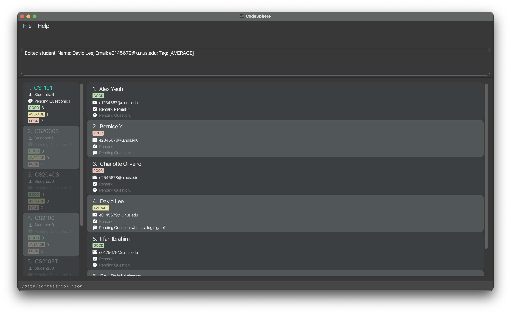*

**Command succeeds:** Success message shown, student successfully edited and updated in database, change in GUI.

**Command failure:** Incorrect format results in an error message shown and the student is not updated in the database.

### Deleting a student : `delete`

Deletes the specified student from the list of students you are overseeing in the selected course.

**Format:** `delete INDEX`
* Deletes the student at the specified `INDEX`.
* The index refers to the index number shown in the displayed students list.
* `INDEX`: Must be a **positive integer** (1, 2, 3, ...), and it should fall within the range of students currently displayed such that it corresponds to a valid student.

**Example:**
* `delete 2` Deletes the student at index 2 of the displayed students list.
* `delete 1` returns the following result:
*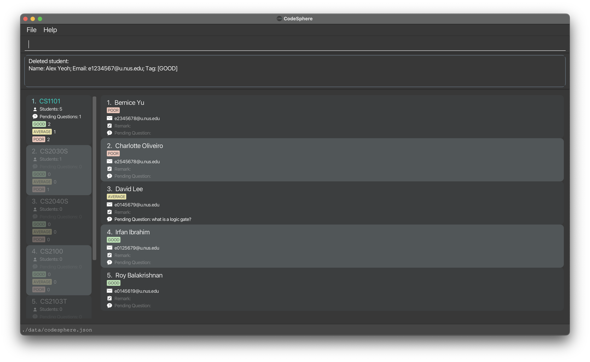*

**Command succeeds:** Success message shown, student successfully removed from database, change in GUI.

**Command failure:** Incorrect format results in an error message shown and the student is not removed from the database.

### Clearing all students : `clear`

Clears all students in the displayed list of students in the selected course.

**Format:** `clear`
* `clear` returns the following result:
*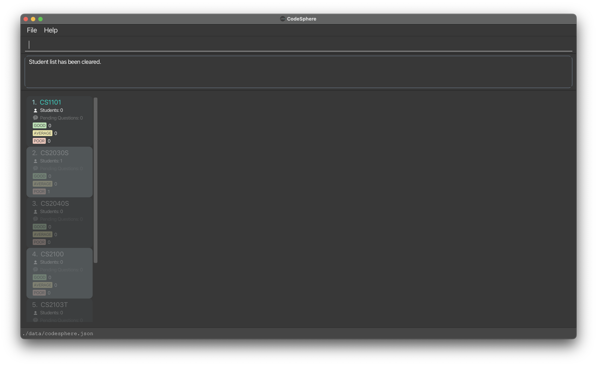*

### Resetting the student list : `reset`

Shows a list of all students in the original state after filtering or sorting.

**Format:**`reset`
* `reset` returns the following result:
*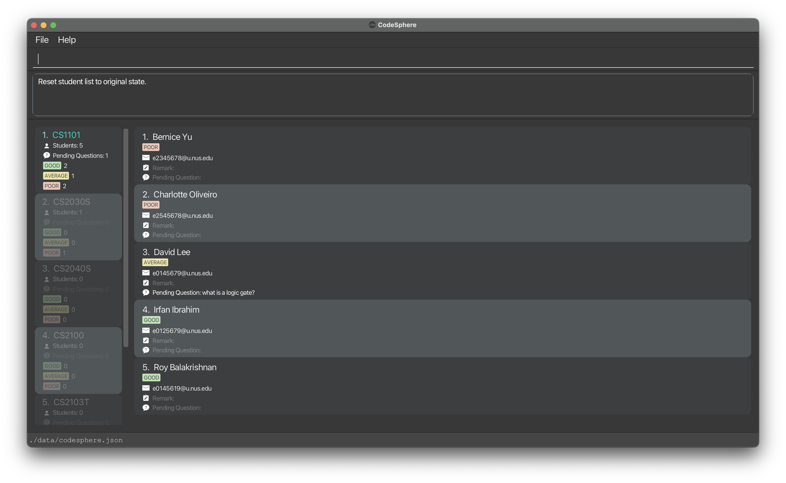*

### Sorting all students : `sort`

Sorts the list of students you are overseeing in the selected course **by name or by tag**.

**Format**: `sort s/SORT_CRITERIA`
* Sorts the displayed student based on the specified `SORT_CRITERIA`.
* `SORT_CRITERIA`: A pre-defined enumerated criteria.
* Valid sort criteria: tag, name.

**Examples:**
* `sort s/tag` Sorts the student list by tag. Students with the GOOD tag are displayed at the top of the list.
* `sort s/name` Sorts the student list by name in alphabetical order.
* `sort s/tag` returns the following result:
*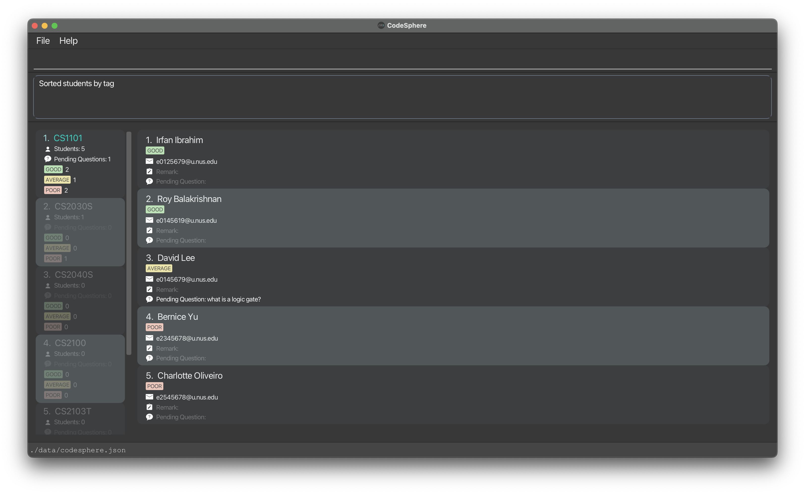*

**Command succeeds:** Success message shown, sorted student list is updated in the database, change in GUI.

**Command failure:** Incorrect format results in an error message shown and the student list is not sorted.

### Finding a student : `find`

Find a student **by a certain field** from the list of students you are overseeing in the selected course.

**Format:** `find [n/NAME] [e/EMAIL] [t/TAG] [pq/QUESTION] [r/REMARK]`
* The search is case-insensitive. For example, hans will match Hans.
* Only **one** prefix can be specified each time you use the command.
* The search is dependent on the prefix.
* The order of the keywords does not matter. For example, `Hans Bo` will match `Bo Hans`.
* Substring search is supported. For example, `find n/Han` will return students whose name is `Hans`.

**Examples:**
* `find n/John` returns `john` and `John Doe`.
* `find t/good` Find the student(s) tagged as `GOOD`, and the details of the student(s) will be displayed.
* `find pq/logic` returns the following result:
*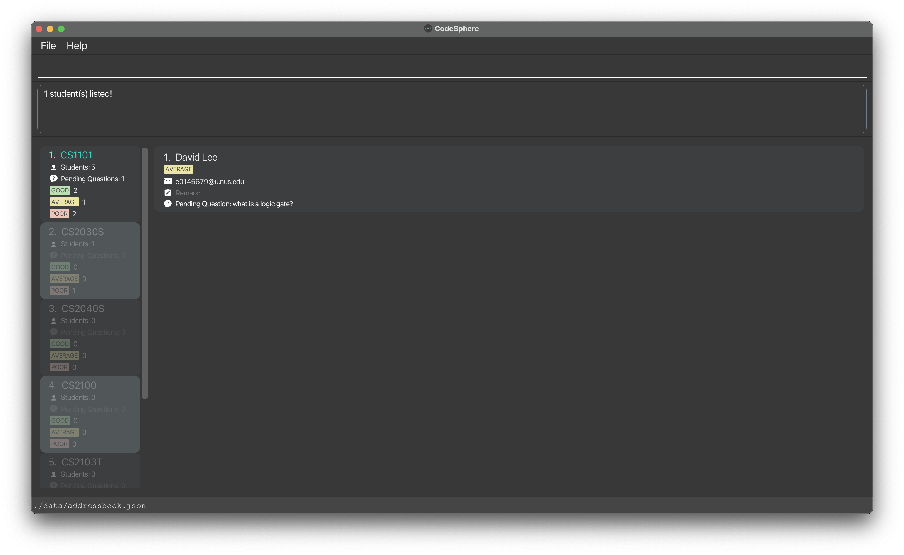*

**Command succeeds:** Success message shown to user, no change in the database, a change in GUI is displayed.

**Command failure:** Users enter the command with incorrect formatting, resulting in an error message shown to the user.

### List all pending questions : `list`

List all the students with non-empty pending question fields.

**Format:** `list pq/`
* Nothing should be specified after `pq/`.
* `list pq/` returns the following result:
*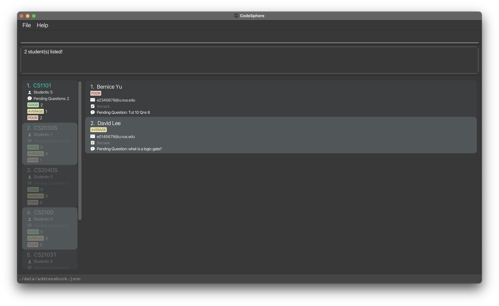*

**Command succeeds:** Success message shown to user, no change in the database, a change in GUI is displayed.

**Command failure:** Users enter the command with incorrect formatting, resulting in an error message shown to the user.

### Adding a remark for a student : `remark`

Adds a remark to the specified student from the list of students.

**Format:** `remark INDEX r/REMARK`
* Adds a remark for the student at the specified `INDEX`.
* The index refers to the index number shown in the displayed students list.
* `INDEX`: Must be a **positive integer** (1, 2, 3, ...), and it should fall within the range of students currently displayed such that it corresponds to a valid student.
* The input remark must not be empty.
* Inputting another remark will overwrite the current remark, i.e. adding of remark is not cumulative.

**Example:**
* `remark 2 r/needs more help` Adds a remark to the student at index 2 of the displayed students list saying needs more help.
* `remark 1 r/late submission` returns the following result:
*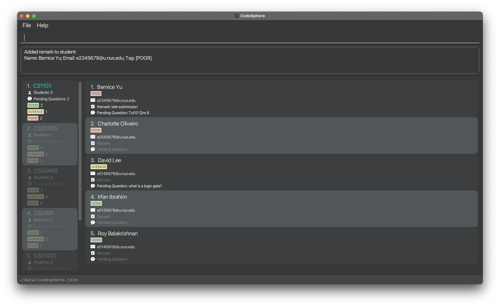*

**Command succeeds:** Success message shown, remark successfully added to student and updated in database, change in GUI.

**Command failure:** Incorrect format results in an error message shown and the remark is not added to the student.

### Adding a pending question for a student : `pq`

Adds a pending question to a specified student from the list of students of a course.

**Format:** `pq INDEX pq/PENDING_QUESTION`
* Adds a pending question for the student at the specified `INDEX`.
* The index refers to the index number shown in the displayed students list.
* `INDEX`: Must be a **positive integer** (1, 2, 3, ...), and it should fall within the range of students currently displayed such that it corresponds to a valid student.
* The input pending question must not be empty.
* Only one pending question is allowed at a time, i.e. adding of pending question is not cumulative.

**Example:**
* `pq 2 pq/What is a logic gate?` Adds a pending question to the student at index 2 of the displayed student, with the question “What is a logic gate?”. This indicates a need to follow-up with the student.
* `pq 1 pq/Tut 10 Qns 8` returns the following result:
*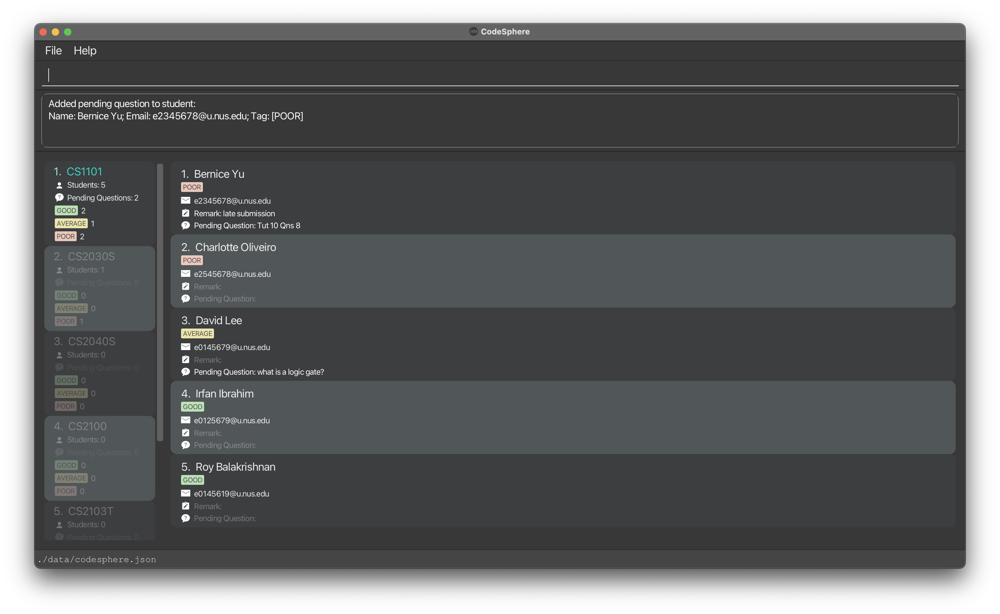*

**Command succeeds:** Success message shown, pending question successfully added and updated in database, change in GUI.

**Command failure:** Incorrect format results in an error message shown and pending question is not added to the student.

### Removing a remark/pending question of a student : `remove`

Removes a remark or pending question of a specified student from the list of students.

**Format:** `remove INDEX [r/] [pq/]`
* Removes a pending question of the student at the specified `INDEX`.
* The index refers to the index number shown in the displayed students list.
* `INDEX`: Must be a **positive integer** (1, 2, 3, ...), and it should fall within the range of students currently displayed such that it corresponds to a valid student.
* At least one of the optional fields must be provided.
* Nothing should be specified after `r/` or `pq/`.

**Examples:**
* `remove 2 pq/` Removes a pending question of the student at index 2 of the displayed students list.
* `remove 2 r/` Removes a remark of the student at index 2 of the displayed students list.
* `remove 1 pq/ r/` returns the following result:
  *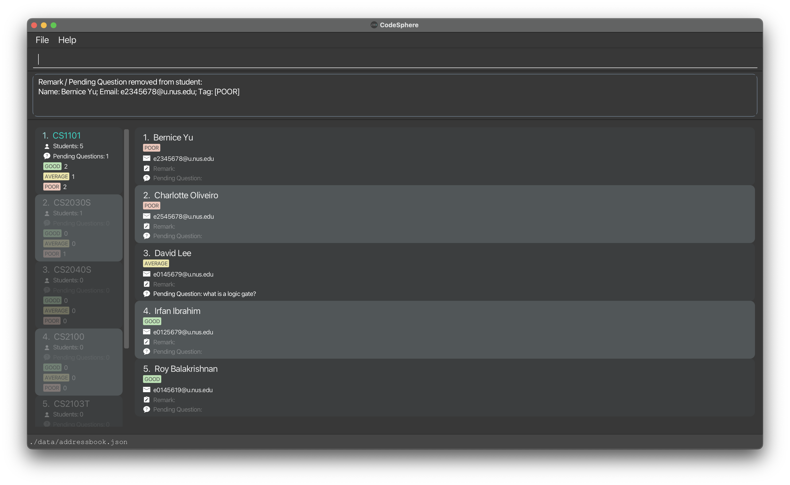*

**Command succeeds:** Success message shown, remark/pending question successfully removed from student, change in GUI.

**Command failure:** Incorrect format results in an error message shown and the remark/pending question is not removed from the student.

### Returning to the home page : `home`
Returns to the [home page](#home-page-commands) showing the list of courses you are overseeing.

**Format:** `home`
* `home` returns the following result:
*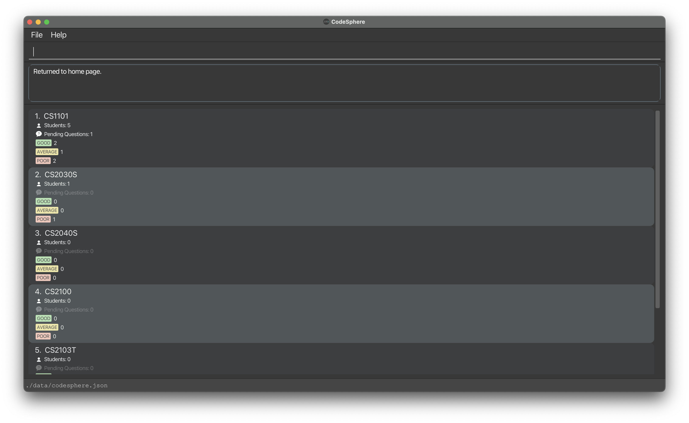*

[_Back to Top_](#table-of-contents)

### **Miscellaneous**

### Saving the data

CodeSphere data is saved in the hard disk automatically after any command that changes the data. There is no need to save manually.

### Editing the data file

CodeSphere data is saved automatically as a JSON file `[JAR file location]/data/codesphere.json`.
Advanced users are welcome to update data directly by editing that data file.

:exclamation: <b>Caution:</b>
If your changes to the data file makes it invalid, CodeSphere will overwrite all data and start with an empty data file. We recommend performing a backup before manually editing data.

[_Back to Top_](#table-of-contents)

## **FAQ**

**Q**: How do I transfer my data to another Computer?

**A**: Install the app in the other computer and overwrite the empty data file it creates with the file that contains the data of your previous CodeSphere home folder.

--------------------------------------------------------------------------------------------------------------------
## **Known Issues**

1. When using multiple screens, if you move the application to a secondary screen, and later switch to using only the primary screen,
   the GUI will open off-screen. The remedy is to delete the preferences.json file created by the application before running the application again.

[_Back to Top_](#table-of-contents)

## **Command Summary**

### Home Page

| Action                | Format, Examples                                           |
|-----------------------|------------------------------------------------------------|
| **Help**              | `help`                                                     |
| **Add Course**        | `add c/COURSENAME`  e.g. `add c/CS1101S`               |
| **Edit Course**       | `edit INDEX c/NEW_COURSENAME`  e.g. `edit 1 c/CS1231S` |
| **Delete Course**     | `delete INDEX` e.g. `delete 1`                             |
| **Clear All Courses** | `clear`                                                    |
| **Select Course**     | `select INDEX` e.g. `select 1`                             |
| **Find Course**       | `find KEYWORD` e.g. `find CS`                              |
| **Reset Course List** | `reset`                                                    |
| **Exit**              | `exit`                                                     |

[_Back to Top_](#table-of-contents)

### Course Page

| Action                                   | Format, Examples                                                                       |
|------------------------------------------|----------------------------------------------------------------------------------------|
| **Help**                                 | `help`                                                                                 |
| **Add Student**                          | `add n/NAME e/EMAIL t/ENUM_TAG` e.g. `add n/Susan Tan e/e0123456@u.nus.edu t/GOOD` |
| **Edit Student**                         | `edit INDEX [n/NAME] [e/EMAIL] [t/ENUM_TAG]`  e.g. `edit 1 n/JOHN`                 |
| **Delete Student**                       | `delete INDEX` e.g. `delete 1`                                                         |
| **Clear All Students**                   | `clear`                                                                                |
| **Reset Student List**                   | `reset`                                                                                |
| **Sort Students**                        | `sort s/SORT_CRITERIA` e.g. `sort s/name`                                              |                                                                                        |
| **Find Students**                        | `find [n/NAME] [e/EMAIL] [t/TAG] [pg/QUESTION] [r/REMARK]` e.g. `find n/John`          |
| **List Students with Pending Questions** | `list pq/`                                                                             |
| **Add Remark**                           | `remark INDEX r/REMARK` e.g. `remark 1 r/needs more help`                          |
| **Add Pending Question**                 | `pq INDEX r/PENDINGQUESTION` e.g. `pq 1 pq/What is a logic gate?`                  |
| **Remove Remark/ Pending Question**   | `remove INDEX [r/] [pq/]` e.g. `remove 2 r/`                                           |
| **Home**                                 | `home`                                                                                 |
| **Exit**                                 | `exit`                                                                                 |

[_Back to Top_](#table-of-contents)

## **Glossary**

| Term/Keyword                       | Definition                                                                                                 |
|------------------------------------|------------------------------------------------------------------------------------------------------------|
| **Command Line Interface (CLI)**   | An interface that allows you to interact with our program by inputting lines of text called command-lines. |
| **Graphical User Interface (GUI)** | An interface that displays information to you and allows you to interact with visual elements.             |
| **Prefix**                         | Characters preceding details you input on the command line. Eg. n/ for name and e/ for email.              |
| **Course**                         | A registered course under NUS.                                                                             |

[_Back to Top_](#table-of-contents)
