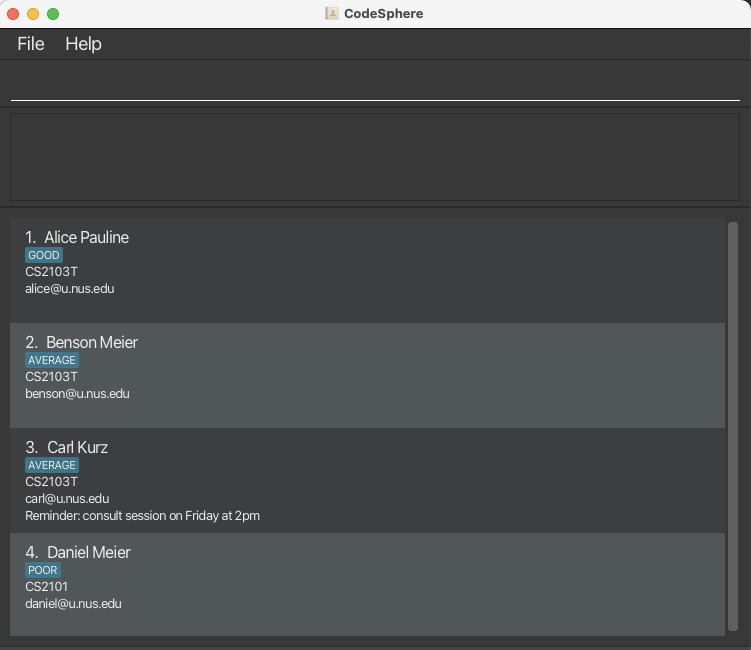

CodeSphere is a **desktop contact management app, optimised for use via a Command Line Interface (CLI)** while still having the benefits of a Graphical User Interface (GUI). It is an app targeted at connecting Year 1 Computer Science students in the NUS School of Computing.

--------------------------------------------------------------------------------------------------------------------

## Table of Contents
1. [**User Guide Tips**](#user-guide-tips)
2. [**Quick Start**](#quick-start)
3. [**Tutorial for Beginners**](#tutorial-for-beginners)
4. [**Features**](#features)
    1. [**Universal Commands**](#universal-commands)
        1. [`help` Viewing help](#viewing-help--help)
        2. [`exit` Exiting the program](#exiting-the-program--exit)
    2. [**Home Page Commands**](#home-page-commands)
        1. [`add` Adding a new course](#adding-a-course--add)
        2. [`edit` Editing the details of a course](#editing-a-course--edit)
        3. [`delete` Delete a course](#deleting-a-course--delete)
        4. [`clear` Clearing all courses](#clearing-all-course--clear)
        5. [`select` Selecting a course](#selecting-a-course--select)
    3. [**Course Page Commands**](#course-page-commands)
        1. [`add` Adding a student](#adding-a-student--add)
        2. [`edit` Editing the details of a student](#editing-a-student--edit-coming-soon)
        3. [`delete` Deleting a student](#deleting-a-student--delete-coming-soon)
        4. [`list` Listing all students](#listing-all-students--list-coming-soon)
        5. [`find` Finding a student](#finding-a-student--find-coming-soon)
        6. [`remark` Adding a remark for a student](#adding-a-remark-for-a-student--remark-coming-soon)
        7. [`pq` Adding a pending question for a student](#adding-a-pending-question-for-a-student--pq-coming-soon)
        8. [`remove` Removing a remark/pending question of a student](#removing-a-remarkpending-question-of-a-student--remove-coming-soon)
        9. [`home` Returning to home page](#returning-to-the-home-page--home-coming-soon)
    4. [**Miscellaneous**](#miscellaneous)
        1. [Saving the data](#saving-the-data)
        2. [Editing the data file](#editing-the-data-file)
5. [**FAQ**](#faq)
6. [**Known Issues**](#known-issues)
7. [**Command summary**](#command-summary)
    1. [**Home Page**](#home-page)
    2. [**Course Page**](#course-page)
8. [**Glossary**](#glossary)

--------------------------------------------------------------------------------------------------------------------
## **User Guide Tips**

### Finding what you need

1. [Quick start](#quick-start) will help you set up CodeSphere.
2. [Tutorial for Beginners](#tutorial-for-beginners) walks you through our graphical interface and also guides you on managing a course on CodeSphere.
3. [Features](#features) will help you understand how our features can be useful for your management.
4. [FAQ](#faq) answers the most common questions from our users. If you have questions for us, this section might just prove extremely useful!
5. [Command Summary](#command-summary) provides a summarised list of our features for your easy reference.
6. [Glossary](#glossary) explains some of the more complicated terms we used in the guide. If you do not understand some terms, this section might help!

--------------------------------------------------------------------------------------------------------------------

## **Quick Start**

1. Ensure you have Java `11` or above installed in your Computer.
2. Download the latest `codesphere.jar` from [here](https://github.com/AY2324S1-CS2103T-W15-4/tp/releases).
3. Copy the file to the folder you want to use as the _home folder_ for the CodeSphere app.
4. Double-click the file to run the app. A GUI similar to the below should appear in a few seconds. This is the home page. Note how the app contains some sample data.

   

In the command box, type in any command and hit enter to execute the command! 
Eg. typing `help` and hitting enter after will show the Help window. Some other example commands you can try:
* `help` : View help.
* `select 1` : Selects and goes into the 1st course in the course list.
* `add c/CS1101S` : Adds a course named `CS1101S` to the course list.
* `edit 1 c/CS1231S` : Updates the first course in the course list with the edited course name.
* `delete 3` : Deletes the third course shown in the course list.
* `exit` : Exits the app.

For a more detailed walk-through on how to use CodeSphere to start managing your students, head to [Tutorial for Beginners](#tutorial-for-beginners).
Else, if you prefer exploring the app yourself, head to [Features](#features) below for the list of commands.

--------------------------------------------------------------------------------------------------------------------
## **Tutorial for Beginners**
*{to be added}*

--------------------------------------------------------------------------------------------------------------------
## **Features**

**:information_source: Notes about the command format:** 

* Words in `UPPER_CASE` are the parameters to be supplied by the user. 
  * e.g. in `add n/NAME`, `NAME` is a parameter which can be used as `add n/John Doe`.

* Items in square brackets are optional. 
  * e.g `n/NAME [t/TAG]` can be used as `n/John Doe t/GOOD` or as `n/John Doe`.

* Items with `…` after them can be used multiple times including zero times. 
  * e.g. `[t/TAG]…` can be used as ` ` (i.e. 0 times), `t/GOOD`, `t/GOOD t/AVERAGE` etc.

* Extraneous parameters for commands that do not take in parameters (such as `help`, `list`, `exit` and `clear`) will be ignored. 
  * e.g. if the command specifies `help 123`, it will be interpreted as `help`.

### **Universal Commands**
Commands in CodeSphere are mostly only used exclusively on the home page or the course page. However, commands in this section can be used on either page at any time.

### Viewing help : `help`

Shows a message explaining how to access the help page.

Format: `help`

### Exiting the program : `exit`

Exits the program.

Format: `exit`

--------------------------------------------------------------------------------------------------------------------
### **Home Page Commands**
CodeSphere has a home page that displays the list of courses you are currently overseeing and have stored in the app.

*{screenshot to be added}*

Commands exclusive to the home page can help you:
* `add` new courses
* `edit` the details of existing courses
* `delete` existing courses
* `clear` all existing courses

The `select` command brings you to the Course page of the selected course.

### Adding a course : `add`
Adds a course to the list of courses.

Format: `add c/COURSENAME`
* `COURSENAME` is a string that is a valid course in the NUS School of Computing.

Examples:
* `add c/CS1101S`
* `add c/CS1231S`

### Editing a course : `edit`
Edits the details of an existing course from the list of courses.

Format: `edit INDEX c/NEW_COURSENAME`
* Edits the course at the specified `INDEX`. Existing course name will be updated to the input course name.
* The index refers to the index number shown in the displayed course list. 
* `NEW_COURSENAME` is a string that is a valid course in the NUS School of Computing.
* `INDEX` must be a positive integer 1, 2, 3, ...

Examples: `edit 1 c/CS1101S` Edits the course of the first course in the course list to be CS1101S.

### Deleting a course : `delete`
Deletes the specified course from the list of courses.

Format: `delete INDEX`
* Deletes the course at the specified `INDEX`.
* The index refers to the index number shown in the displayed course list.
* `INDEX` must be a positive integer 1, 2, 3, ...

Examples: `delete 2` Deletes the course at index 2 of the displayed course list.

### Clearing all course: `clear`
Clears all courses in the displayed list of courses.

Format: `clear`

### Selecting a course: `select`
Selects the specified course from the list of courses.

Format: `select INDEX`
* Selects the course at the specified `INDEX`.
* The index refers to the index number shown in the displayed course list.
* `INDEX` must be a positive integer 1, 2, 3, ...

Example: `select 2` Selects the course at index 2 of the displayed course list.

--------------------------------------------------------------------------------------------------------------------
### **Course Page Commands**
Once you have created and selected a course to manage, you can now start adding your students in the course that you wish to track!
The Course page of a course displays the list of students that you are overseeing in your course (added by you).
Students are arranged in order of addition.

*{screenshot to be added}*

Commands exclusive to the course page can help you:
* `add` new students
* `edit` the details of existing students
* `delete` existing students
* `list` all existing students in the course
* `find` an existing student in the course
* add a `remark` to a student
* add a pending question `pq` to a student 
* `remove` a remark or pending question from a student

### Adding a student : `add`
Adds a student to the list of students in the selected course that the user is overseeing.

Format: `add n/NAME e/EMAIL t/ENUM_TAG`
* NAME: a string that is a valid name.
* EMAIL: string ending with @u.nus.edu.
* ENUM_TAG: a pre-defined enumerated tag definitions GOOD, AVERAGE, POOR.

Examples:
* `add n/Susan Tan e/e0946283@u.nus.edu t/GOOD`
* `add n/Ben Koh e/e9739423@u.nus.edu t/AVERAGE`

**Command succeeds:** Success message shown to user, student successfully added and stored in the database, change in GUI.

**Command failure:** Users enter the command with incorrect formatting, resulting in an error message shown to the user and the student is not added and stored into the database.

### Editing a student : `edit` [coming soon]

Edits an existing student that the user is currently overseeing.

Format: `edit INDEX [n/NAME] [c/COURSE] [e/EMAIL] [r/REMARK]...`
* Edits the person at the specified `INDEX`. The index refers to the index number shown in the displayed students list.
* The index **must be a positive integer** 1, 2, 3, …​
* At least one of the optional fields must be provided.
* Existing values will be updated to the input values.
* When editing tags, the existing tags of the person will be removed i.e adding of tags is not cumulative.
* You can remove all the person’s tags by typing t/ without specifying any tags after.

Examples:
* `edit 1 c/CS1101S e/e0946283@u.nus.edu` Edits the course and email address of the 1st person to be CS1101S and e0946283@u.nus.edu respectively.
* `edit 2 n/Alex Yeoh t/` Edits the name of the 2nd person to be Alex Yeoh and clears all existing tags.

**Command succeeds:** Success message shown to user, relevant fields of the specified student successfully updated and stored in database, change in GUI.

**Command failure:** Users enter the command with incorrect formatting, resulting in an error message shown to the user and the relevant fields of the specified student are not updated.

### Deleting a student: `delete` [coming soon]

Deletes the specified student from the list of students.

Format: `delete INDEX`
* Deletes the student at the specified `INDEX`. The index refers to the index number shown in the displayed students list.
* The index refers to the index number shown in the displayed students list.
* The index **must be a positive integer** 1, 2, 3, …​

Examples:
* `delete 2` Deletes the student at index 2 of the displayed students list.

**Command succeeds:** Success message shown to user, the specified student is successfully deleted and removed from the database, change in GUI.

**Command failure:** Users enter the command with incorrect formatting, resulting in an error message shown to the user and the specified student is not deleted and removed from the database.

### Listing all students: `list` [coming soon]
Shows a list of all students the user is overseeing in the selected course.

**Format:** `list`

### Finding a student: `find`
Find a student from the list of students by name.

**Format:** `find [KEYWORDS]`
* The search is case-insensitive. e.g hans will match Hans.
* The order of the keywords does not matter. e.g. Hans Bo will match Bo Hans.
* Only the name is searched.
* Only full words will be matched e.g. Han will not match Hans.

**Example:**
* `find John` returns `john` and `John Doe`.
* `find Fiona Alissa` Find the student(s) with name Fiona or Alissa, and the details of the student(s) will be displayed.

**Command succeeds:** Success message shown to user, no change in the database, a change in GUI is displayed.

**Command failure:** Users enter the command with incorrect formatting, resulting in an error message shown to the user and no matched course is shown.

### Find a pending question: `find pq`
List all the students with pending questions. 

**Format:** `find pq`

**Example:**
* `find John` returns all students with non-empty pending questions.

**Command succeeds:** Success message shown to user, no change in the database, a change in GUI is displayed.

**Command failure:** Users enter the command with incorrect formatting, resulting in an error message shown to the user and no matched course is shown.

### Adding a remark for a student: `remark`
Adds a remark to the specified student from the list of students.

Format: `remark INDEX r/REMARK`
* Adds a remark for the student at the specified `INDEX`. The index refers to the index number shown in the displayed students list.
* The index must be a **positive integer** 1, 2, 3, …

**Example:**
* `remark 2 r/needs more help` Adds a remark to the student at index 2 of the displayed students list saying needs more help.

**Command succeeds:**
* Success message shown to user, a remark is added to the specified student and this information is updated to the database, change in GUI.

**Command failure:**
* Users enter the command with incorrect formatting, resulting in an error message shown to the user and no new remark is added to the specified student.

### Adding a pending question for a student: `pq`
Adds a pending question to a specified student from the list of students of a course.

**Format:** `pq INDEX pq/PENDINGQUESTION`
* Adds a pending question for the student at the specified `INDEX`. The index refers to the index number shown in the displayed students list.
* The index must be a **positive integer** 1, 2, 3, …

**Example:**
* `pq 2 pq/What is a logic gate?` Adds a pending question to the student at index 2 of the displayed student list asking the question “What is a logic gate?”. This indicates a requirement to follow-up with the student.

**Command succeeds:**
* Success message shown to user, a remark is added to the specified student and this information is updated to the database, change in GUI.

**Command failure:**
* Users enter the command with incorrect formatting, resulting in an error message shown to the user and no new remark is added to the specified student.

### Removing a remark/pending question of a student: `remove`
Removes a remark or pending question of a specified student from the list of students.

**Format:** `remove INDEX r/ pq/`
* Removes a pending question of the student at the specified `INDEX`. The index refers to the index number shown in the displayed students list.
* The index must be a **positive integer** 1, 2, 3, …

**Example:**
* `remove 2 pq/` Removes a pending question of the student at index 2 of the displayed students list.

**Command succeeds:** 
* Success message shown to user, a pending question is removed from the specified student and this information is updated to the database, change in GUI.

**Command failure:**
* Users enter the command with incorrect formatting, resulting in an error message shown to the user and no new remark is added to the specified student.

### Returning to the home page: `home` [coming soon]

--------------------------------------------------------------------------------------------------------------------
### **Miscellaneous**

### Saving the data

CodeSphere data is saved in the hard disk automatically after any command that changes the data. There is no need to save manually.

### Editing the data file

CodeSphere data is saved automatically as a JSON file `[JAR file location]/data/codesphere.json`. Advanced users are welcome to update data directly by editing that data file.

--------------------------------------------------------------------------------------------------------------------
## **FAQ**

Q: How do I transfer my data to another Computer?
A: Install the app in the other computer and overwrite the empty data file it creates with the file that contains the data of your previous CodeSphere home folder.

--------------------------------------------------------------------------------------------------------------------
## **Known Issues**

1. When using multiple screens, if you move the application to a secondary screen, and later switch to using only the primary screen, 
the GUI will open off-screen. The remedy is to delete the preferences.json file created by the application before running the application again.

--------------------------------------------------------------------------------------------------------------------
## **Command Summary**

--------------------------------------------------------------------------------------------------------------------

### Home Page
Action | Format, Examples
--------|------------------
**Help** | `help`
**Add Course** | `add c/COURSENAME`  e.g. `add c/CS1101S`
**Edit Course** | `edit INDEX c/NEW_COURSENAME`  e.g. `edit 1 c/CS1231S`
**Delete Course** | `delete INDEX`   e.g. `delete 2`
**Clear All Courses** | `clear`
**Select Course** | `select INDEX`   e.g. `select 1`
**Exit** | `exit`

### Course Page
Action | Format, Examples
--------|------------------
**Help** | `help`
**Add Student** | `add n/NAME e/EMAIL t/ENUM_TAG`  e.g. `add n/Susan Tan e/e0123456@u.nus.edu t/GOOD`
**Edit Student** | `edit INDEX [n/NAME] [e/EMAIL] [t/TAG] [r/REMARK]`  e.g. `edit 1 e/anotherEmail@u.nus.edu`
**Delete Student** | `delete INDEX`   e.g. `delete 2`
**List Students** | `list`
**Find Student** | `find [KEYWORDS]`  e.g. `find JOHN`
**Add Remark** | `remark INDEX r/REMARK`  e.g. `remark 1 r/needs more help`
**Add Pending Question** | `pq INDEX pq/PENDING_QUESTION`   e.g. `pq 1 pq/What is a logic gate?`
**Remove Remark/ Pending Question** | `remove INDEX [r/] [pq/]`   e.g. `remove 2 pq/`
**Exit** | `exit`

--------------------------------------------------------------------------------------------------------------------
## **Glossary**

*{to be added}*

